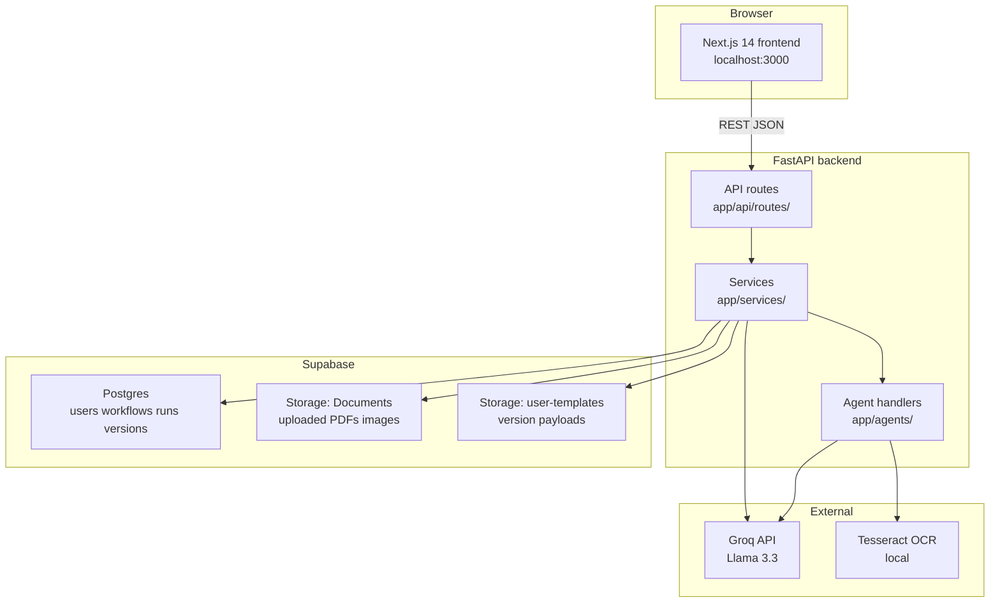
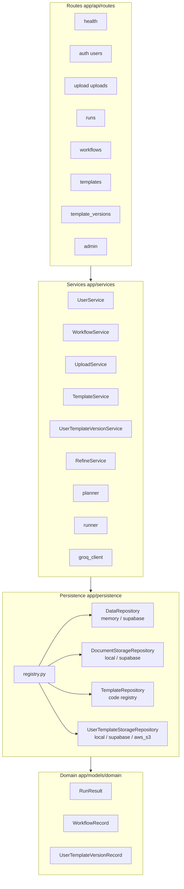
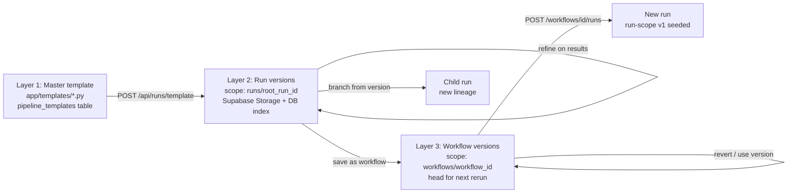
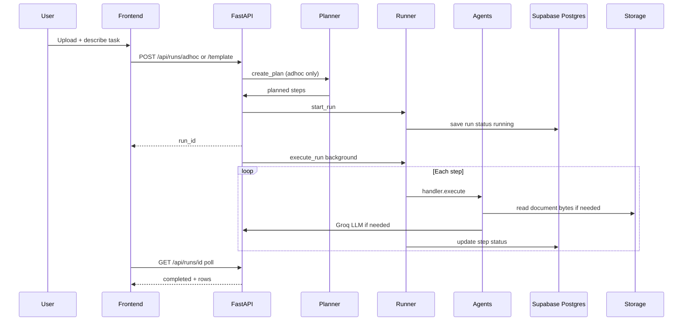
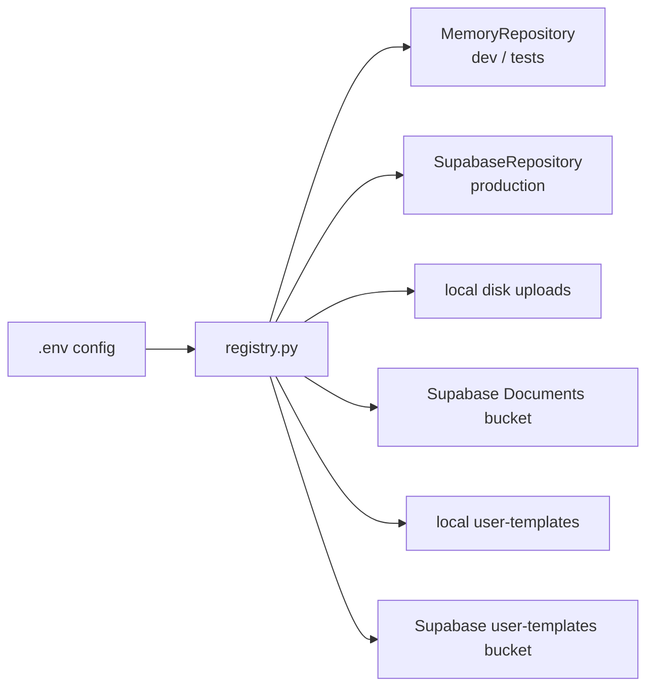
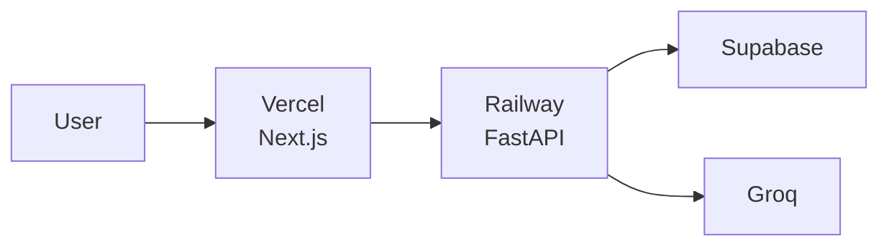

# AgentFlow — System Architecture

High-level architecture for the Document Processor / AgentFlow application.  
For product scope and API details see [SPEC.md](./SPEC.md).

---

## System context



---

## Layered backend design

Follows [docs/ENGINEERING-PRINCIPLES.md](./docs/ENGINEERING-PRINCIPLES.md): routes → services → persistence → domain models.



| Layer | Directory | Responsibility |
|-------|-----------|----------------|
| Routes | `app/api/routes/` | HTTP validation, DI, map responses |
| Mappers | `app/api/mappers/` | Domain ↔ API model conversion |
| Services | `app/services/` | Business logic, orchestration |
| Agents | `app/agents/handlers/` | Single-step pipeline execution |
| Persistence | `app/persistence/` | Storage protocols + backends |
| Domain | `app/models/domain/` | Plain dataclasses |
| API models | `app/models/api/` | Pydantic request/response schemas |

---

## Three-layer template model

User refinements do not mutate master templates in code. Three layers:



| Layer | Canonical storage | DB pointer |
|-------|-------------------|------------|
| Master | Python modules + optional `pipeline_templates` row | N/A |
| Run version | `user-templates` bucket key `runs/{root_id}/…` | `workflow_runs.current_template_version_id` |
| Workflow version | `user-templates` bucket key `workflows/{id}/…` | `workflows.current_template_version_id` |

When a version pointer is set, Postgres stores metadata only (`user_template_versions`); full `planned_steps` and `extraction_prompt` live in object storage.

---

## Pipeline execution flow



**Refine flow:** `POST /api/runs/{id}/refine` → `RefineService` → `pipeline_refiner` agent → new version in Storage → child run with updated plan. Workflow-linked runs also update workflow head version.

---

## Agent registry

All pipeline steps reference `agent_type` strings resolved via `app/agents/core/registry.py`.

| agent_type | Handler | Purpose |
|------------|---------|---------|
| `processor.text_extract` | Text extract | Digital PDF text |
| `processor.ocr` | OCR | Scanned images / PDFs |
| `transform.field_extractor` | Field extractor | LLM structured extraction |
| `transform.rules` | Rules | Flag / filter rows |
| `output.formatter` | Formatter | CSV / JSON output |
| `transform.pipeline_refiner` | Pipeline refiner | Chat refine (internal) |

---

## Persistence registry

Backends selected via `app/persistence/registry.py` and env vars (`PERSISTENCE_BACKEND`, `DOCUMENT_STORAGE`, `USER_TEMPLATE_STORAGE` = `auto` | explicit).



| Concern | Protocol | Backends |
|---------|----------|----------|
| Users, workflows, runs, version index | `DataRepository` | memory, supabase |
| Uploaded files | `DocumentStorageRepository` | local, supabase |
| Master templates | `TemplateRepository` | memory (code), supabase mirror |
| User template payloads | `UserTemplateStorageRepository` | local, supabase, aws_s3 future |

---

## Frontend structure

```
frontend/src/
├── app/
│   ├── page.tsx              # Landing: upload + template picker
│   ├── results/[runId]/      # Poll run, refine chat, version panel
│   ├── workflows/            # List + detail + rerun
│   └── account/              # Email sign-in
├── components/
│   ├── refine-chat.tsx
│   ├── template-version-panel.tsx
│   └── run-display.tsx
└── lib/api.ts                # Typed API client
```

Session: `user_id` in `localStorage` after `POST /api/auth/session`.

---

## Database schema (core tables)

| Table | Purpose |
|-------|---------|
| `users` | App users |
| `workflows` | Saved reusable plans (+ `current_template_version_id`) |
| `workflow_steps` | Inline steps when not version-only |
| `workflow_runs` | Execution history (+ lineage, cached docs, version pointer) |
| `workflow_step_runs` | Per-step output JSON |
| `pipeline_templates` | Master template catalog mirror |
| `user_template_versions` | Version metadata index |
| `refinement_events` | User refine messages for owner aggregation |

Migrations: `backend/supabase/migrations/` (004–007 for refine + versioning).

---

## Key API surface

| Area | Endpoints |
|------|-----------|
| Runs | `POST /api/runs/adhoc`, `/template`, `GET /{id}`, `POST /{id}/refine` |
| Versions | `GET/POST /api/runs/{id}/template-versions`, `POST /api/runs/{id}/revert` |
| Workflows | `POST /api/workflows`, `/from-run/{id}`, `GET /{id}/runs`, `POST /{id}/runs` |
| Workflow versions | `GET /api/workflows/{id}/template-versions`, `POST /api/workflows/{id}/revert` |
| Admin | `POST /api/admin/templates/{id}/synthesize`, `/preview`, `/apply` (owner, later) |

---

## Deployment target (planned)



See [docs/PLAN-AND-NEXT-STEPS.md](./docs/PLAN-AND-NEXT-STEPS.md) for deploy checklist.

---

*Last updated: 2026-08-07*
