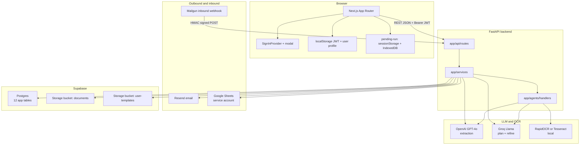
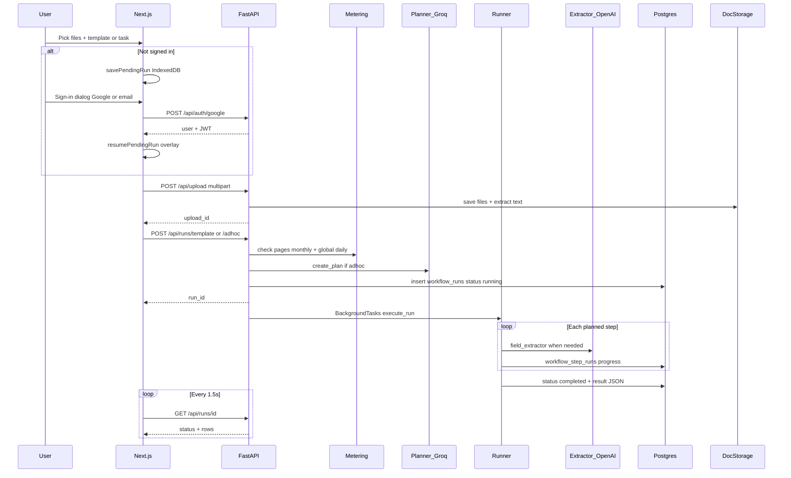
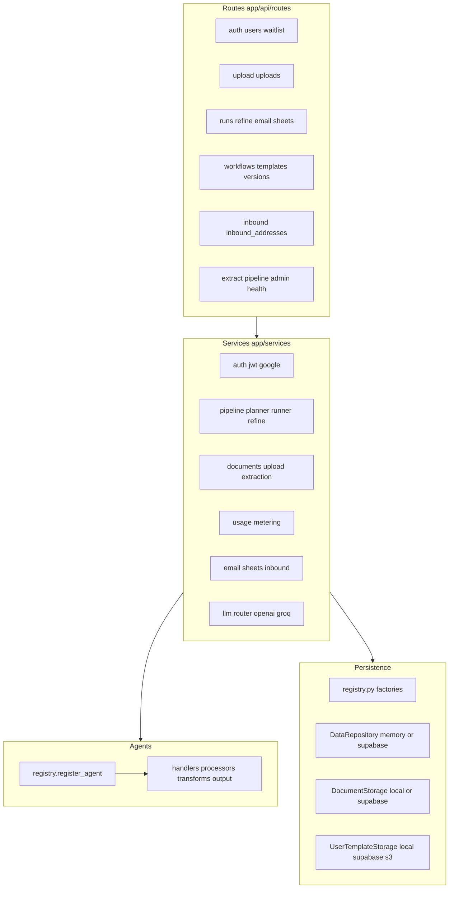
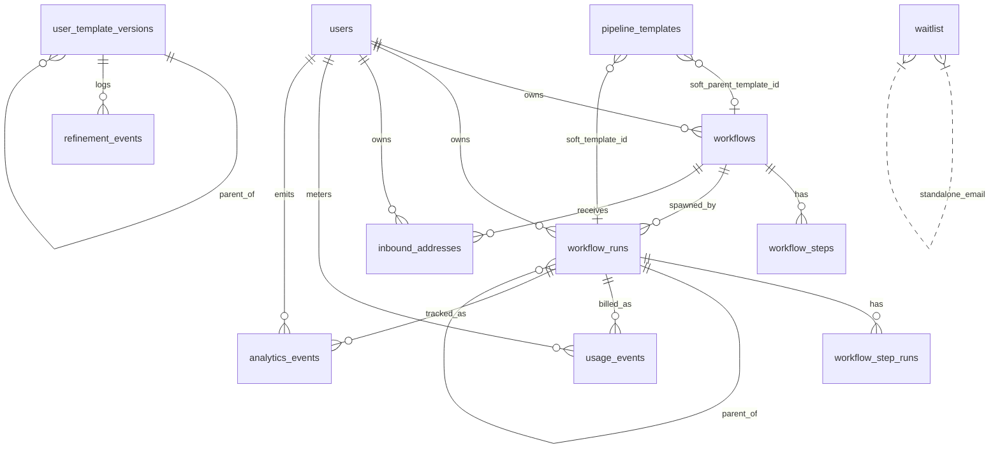
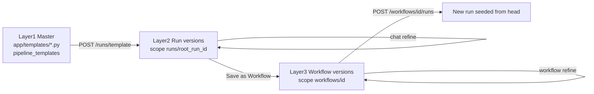
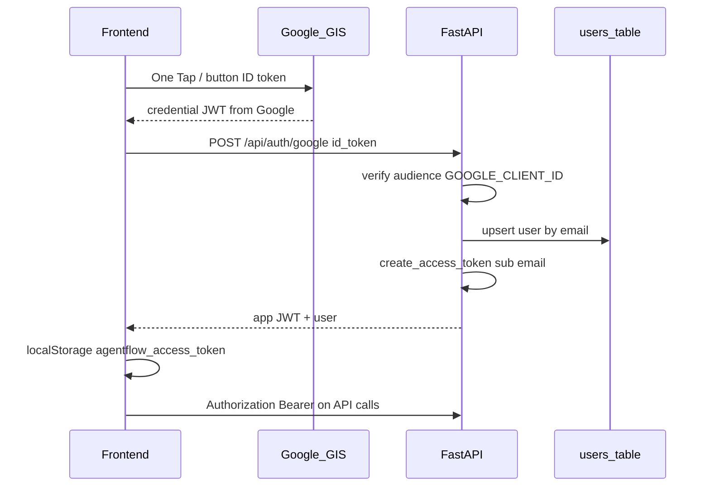
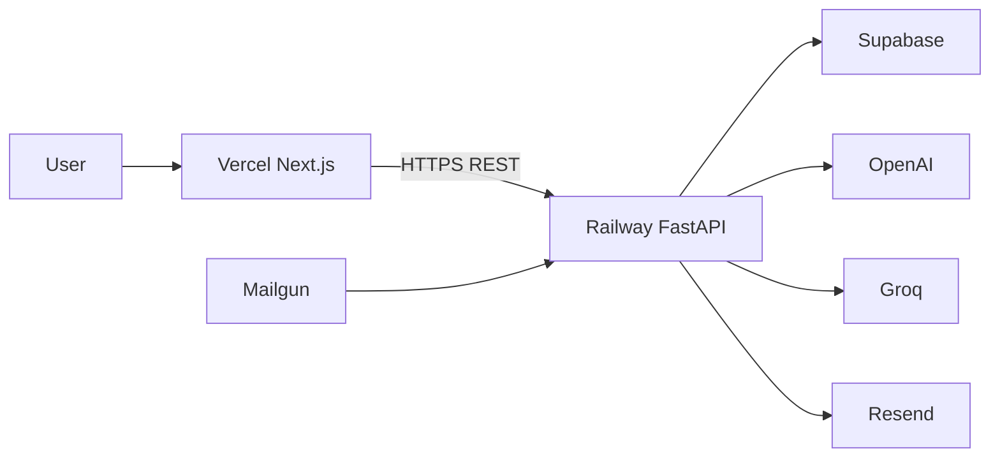

# AgentFlow — System Architecture (Study Guide)

**Interview-ready source of truth** for how this product works: data model, auth, storage, APIs, keys, and the code to open when explaining a flow.

| | |
|---|---|
| **Product** | AgentFlow (Document Processor) — upload documents, describe a task (or pick a template), run an AI agent pipeline, get structured rows, refine via chat, optionally save as a reusable workflow |
| **Stack** | Next.js (App Router) ↔ FastAPI ↔ Groq (plan/refine) + OpenAI GPT-4o (extract) + RapidOCR/Tesseract ↔ Supabase Postgres + Storage |
| **Repos** | [`backend/`](../backend/), [`frontend/`](../frontend/) |
| **Related** | Product/API detail: [SPEC.md](./SPEC.md) · Engineering rules: [ENGINEERING-PRINCIPLES.md](./ENGINEERING-PRINCIPLES.md) · Next work: [NEXT-STEPS.md](./NEXT-STEPS.md) |
| **Last updated** | 2026-08-10 |

---

## Table of contents

1. [Elevator pitch & mental model](#1-elevator-pitch--mental-model)
2. [System context diagram](#2-system-context-diagram)
3. [Request lifecycle (happy path)](#3-request-lifecycle-happy-path)
4. [Backend layers & agent registry](#4-backend-layers--agent-registry)
5. [Database — ER & table catalog](#5-database--er--table-catalog)
6. [Storage model & three-layer templates](#6-storage-model--three-layer-templates)
7. [Auth & authorization](#7-auth--authorization)
8. [Metering, caps & rate limits](#8-metering-caps--rate-limits)
9. [Integrations](#9-integrations)
10. [Keys & config cheat sheet](#10-keys--config-cheat-sheet)
11. [Frontend map](#11-frontend-map)
12. [Open this file when…](#12-open-this-file-when)
13. [Interview FAQ](#13-interview-faq)
14. [Deployment sketch](#14-deployment-sketch)

---

## 1. Elevator pitch & mental model

**What it does:** A user uploads PDFs/images (invoices, receipts, resumes, etc.), picks a **template** or writes a plain-English **task**. The backend **plans** a short agent pipeline (OCR/text → LLM field extract → rules → format), **runs** it asynchronously, and the UI **polls** until structured rows appear. The user can **refine** extraction in chat (creates a versioned child run), **save as a workflow** for reuse, and optionally deliver via **email**, **Google Sheets**, or **inbound email** attachments.

**One-line architecture:**

> Browser (Next.js + JWT) → FastAPI routes → services → registered agent handlers → Groq/OpenAI/OCR → Supabase Postgres (metadata) + object storage (files & version payloads).

**Auth gate (important product decision):**

- **Public:** browse template catalog, health, waitlist, sign-in endpoints.
- **Protected:** upload, run, refine, workflows, usage — require app JWT.
- Unsigned users can select files + template on home; hitting Run opens a **centered sign-in dialog**. After sign-in, pending docs resume automatically (blur overlay → results page). No anonymous LLM spend → metering and telemetry always attach to a `user_id`.

**LLM split (cost/quality):**

| Task | Provider | Why |
|------|----------|-----|
| Field extraction | **OpenAI GPT-4o** (+ mini fallback) | Highest quality structured JSON / schema adherence |
| Planner, refine chat, pipeline refiner | **Groq** (Llama 3.3 etc.) | Fast + cheaper for planning / chat |

---

## 2. System context diagram



---

## 3. Request lifecycle (happy path)

### 3.1 End-to-end sequence



### 3.2 Stage cheat sheet

| Stage | HTTP | Backend | Notes |
|-------|------|---------|-------|
| Sign-in | `POST /api/auth/google` or `/api/auth/session` | `auth.py`, `jwt.py` | Returns `{ user, token, is_new_user }` |
| Upload | `POST /api/upload` | `UploadService.process_upload_batch` | Text/OCR at **upload** time; max 10 files; extensions pdf/png/jpg/jpeg |
| Plan | inside adhoc / `POST /api/pipeline/create` | `planner.create_plan` | Groq + agent catalog |
| Template plan | `/api/runs/template` | `TemplateService.build_plan` | Code templates in `app/templates/` |
| Start run | `/api/runs/*` | `start_run` + `BackgroundTasks` | Returns immediately with `run_id` |
| Execute | background | `runner.execute_run` | Handlers via `get_handler(agent_type)` |
| Poll | `GET /api/runs/{id}` | ownership check | Frontend `useRunPolling` @ **1500ms** |
| Refine plan | `POST .../refine/plan` | `refine_chat.plan_refinement` | Clarify intent + preview |
| Refine apply | `POST .../refine` | `RefineService.refine_and_start` | Child run + `parent_run_id` |
| Save workflow | `POST /api/workflows/from-run/...` | WorkflowService | Copies plan for reuse |

### 3.3 Pending-run resume (unsigned → signed)

1. User selects files/template on home, clicks Run → `ensureUser()` throws `SignInRequiredError`.
2. Frontend `savePendingRun({ kind, files, templateId, task })`:
   - **Metadata** → `sessionStorage` key `agentflow_pending_run`
   - **File bytes** → IndexedDB DB `agentflow_pending_run`
3. `SignInProvider` opens modal (no navigation to `/account`).
4. On success: if `hasPendingRun()`, show **ProcessingOverlay**, `resumePendingRun()` uploads + starts run, `router.push(/results/{run_id})`.
5. If no pending intent (nav Sign in only): close modal, **stay on current page**.

Key files: `frontend/src/lib/pending-run.ts`, `frontend/src/lib/resume-pending-run.ts`, `frontend/src/hooks/use-sign-in.tsx`.

---

## 4. Backend layers & agent registry

Follows [ENGINEERING-PRINCIPLES.md](./ENGINEERING-PRINCIPLES.md): **routes → services → persistence → domain**. Routes must not talk to Supabase/disk directly.



| Layer | Directory | Responsibility |
|-------|-----------|----------------|
| Routes | `backend/app/api/routes/` | HTTP, DI, status codes, map to API models |
| Dependencies | `backend/app/api/dependencies.py` | `CurrentUserDep`, repo injection |
| Ownership | `backend/app/api/ownership.py` | `require_self`, `require_workflow_owner`, `require_run_access` |
| Services | `backend/app/services/` | Business logic |
| Agents | `backend/app/agents/` | One step = one handler |
| Persistence | `backend/app/persistence/` | Protocols + backends |
| Domain | `backend/app/models/domain/` | Dataclasses |
| API models | `backend/app/models/api/` | Pydantic schemas |
| Config | `backend/app/config.py` | All settings from env |

### Registered agents

Bootstrap: `import app.agents.handlers` in `main.py` lifespan registers all handlers.

| `agent_type` | Handler path | Role | Uses LLM? |
|--------------|--------------|------|-----------|
| `processor.text_extract` | `handlers/processors/text_extract.py` | Digital PDF text (PyMuPDF / Docling) | No |
| `processor.ocr` | `handlers/processors/ocr.py` | Scanned PDF/images (RapidOCR default) | No |
| `transform.field_extractor` | `handlers/transforms/field_extractor.py` | Structured fields via OpenAI | **Yes** |
| `transform.rules` | `handlers/transforms/rules.py` | Flag / filter / validate rows | No |
| `transform.pipeline_refiner` | `handlers/transforms/pipeline_refiner.py` | Refine-time plan/prompt rewrite (Groq) | **Yes** |
| `output.formatter` | `handlers/output/formatter.py` | Shape CSV/JSON/table | No |
| `output.email` | `handlers/output/email_agent.py` | In-pipeline Resend | No (HTTP) |
| `output.google_sheets` | `handlers/output/sheets_agent.py` | In-pipeline Sheets push | No (HTTP) |

Registry API: `register_agent`, `get_handler`, `get_agent_catalog` in `app/agents/core/registry.py`. Planner reads the catalog to choose steps.

### App entry

`backend/app/main.py`:

- Lifespan: seed pipeline templates, import handlers
- Middleware: SlowAPI rate limits, CORS
- Mounts all routers under `/api/...`

---

## 5. Database — ER & table catalog

**Source of truth:** [`backend/supabase/schema.sql`](../backend/supabase/schema.sql) for fresh installs + incremental [`backend/supabase/migrations/`](../backend/supabase/migrations/) (`001`–`013`) for existing DBs.

**Footnote — schema drift:** column `workflow_runs.transient_refinement` exists in migration `006` but is not in `schema.sql`. Prefer migrations when upgrading a live project; sync `schema.sql` when convenient.

### 5.1 ER diagram



Soft links (`parent_template_id`, `template_id`) are **text**, not FKs — master catalog IDs like `invoice` live in code and/or `pipeline_templates`.

### 5.2 Table catalog

#### `users`
| | |
|---|---|
| **Purpose** | App identity (not Supabase Auth users) |
| **PK** | `id` uuid |
| **Columns** | `name`, `email`, `created_at`, `is_admin` |
| **Indexes** | `idx_users_email` |
| **Written by** | Auth sign-in / register |

#### `workflows`
| | |
|---|---|
| **Purpose** | Saved reusable pipelines |
| **PK** | `id` |
| **FK** | `user_id` → `users` CASCADE |
| **Notable** | `parent_template_id`, `current_template_version_id`, `extraction_prompt`, `default_email`, `default_sheets_url`, `task_description`, `source` |
| **Indexes** | `idx_workflows_user_id` |

#### `workflow_steps`
| | |
|---|---|
| **Purpose** | Ordered agent steps for a saved workflow |
| **FK** | `workflow_id` → `workflows` CASCADE |
| **Unique** | `(workflow_id, step_order)` |
| **Columns** | `agent_type`, `config` jsonb, `reason` |

#### `workflow_runs`
| | |
|---|---|
| **Purpose** | One execution (adhoc or workflow-linked) |
| **FK** | `workflow_id` → workflows SET NULL; `user_id` → users SET NULL (`011`); `parent_run_id` → self SET NULL |
| **Notable** | `upload_id`, `document_ids`, `status`, `planned_steps`, `result`, `template_id`, `current_template_version_id`, `extraction_prompt`, `cached_documents`, `refine_summary`, `transient_refinement` (mig 006) |
| **Statuses** | typically `running` → `completed` \| `failed` |

#### `workflow_step_runs`
| | |
|---|---|
| **Purpose** | Per-step status + output during a run |
| **FK** | `run_id` → `workflow_runs` CASCADE |
| **Unique** | `(run_id, step_order)` |

#### `pipeline_templates`
| | |
|---|---|
| **Purpose** | Master template catalog mirror (also defined in Python `app/templates/`) |
| **PK** | `id` text (e.g. `invoice`) |
| **Notable** | `fields`, `rules`, `suggested_steps`, `extraction_instructions`, `is_active`, `sort_order` |

#### `user_template_versions`
| | |
|---|---|
| **Purpose** | Index of refined template versions; **payload in object storage** |
| **PK** | `id` uuid (app-supplied) |
| **Check** | `scope_type` ∈ `run` \| `workflow` |
| **FK** | `parent_version_id` → self |
| **Unique** | `(scope_type, scope_id, version_number)` |
| **Key** | `storage_key` → blob in `user-templates` bucket |

#### `refinement_events`
| | |
|---|---|
| **Purpose** | Audit of user refine messages |
| **FK** | `version_id` → `user_template_versions` CASCADE |

#### `inbound_addresses`
| | |
|---|---|
| **Purpose** | Per-workflow ingest email (`flow-….@domain`) |
| **PK** | `address_id` |
| **Unique** | `full_address` |
| **FK** | `user_id`, `workflow_id` CASCADE |

#### `usage_events`
| | |
|---|---|
| **Purpose** | Page metering (positive charge + negative refund) |
| **FK** | `user_id` CASCADE; `run_id` SET NULL |
| **Indexes** | `idx_usage_events_user_month (user_id, created_at)` |
| **event_type** | default `extraction` |

#### `waitlist`
| | |
|---|---|
| **Purpose** | Pro interest from pricing page |
| **Unique** | `email` — **no FK** to users |

#### `analytics_events`
| | |
|---|---|
| **Purpose** | Product analytics (runs, errors, durations) |
| **FK** | `user_id` SET NULL; `run_id` SET NULL |

### 5.3 Migration timeline

| # | Adds |
|---|------|
| 001 | `planned_steps` on runs |
| 002 | `users`, workflow ownership, `document_ids` |
| 003 | `pipeline_templates` |
| 004 | Refine lineage + `cached_documents` |
| 005 | `extraction_prompt`, `template_id` |
| 006 | `transient_refinement` |
| 007 | `user_template_versions`, `refinement_events` |
| 008 | `inbound_addresses` |
| 009 | `default_email`, `default_sheets_url` |
| 010 | `usage_events`, `waitlist`, `analytics_events`, `users.is_admin` |
| 011 | `workflow_runs.user_id` + backfill |

---

## 6. Storage model & three-layer templates

### 6.1 Document files

| Mode | Config | Location |
|------|--------|----------|
| Local | `DOCUMENT_STORAGE=local` or auto without Supabase | `{UPLOAD_DIR}/{upload_id}/{document_id}.ext` + `manifest.json` |
| Supabase | `DOCUMENT_STORAGE=supabase` or auto with keys | Bucket `SUPABASE_DOCUMENTS_BUCKET` (default `documents`) |

`upload_id` is a storage key string, **not** a Postgres table. Runs store `upload_id` + `document_ids` jsonb.

### 6.2 User template payloads

| Mode | Config | Location |
|------|--------|----------|
| Local | `USER_TEMPLATE_STORAGE=local` | under upload dir `user-templates/` |
| Supabase | `supabase` / auto | Bucket `user-templates` |
| AWS S3 | `aws_s3` | Future swap via `AWS_S3_*` |

Postgres `user_template_versions` holds metadata; full `planned_steps` / prompts live in the blob at `storage_key`.

### 6.3 Three-layer template model

User refinements **never mutate** master Python templates.



| Layer | Canonical store | DB pointer |
|-------|-----------------|------------|
| Master | Python + optional `pipeline_templates` | N/A |
| Run version | `user-templates` key `runs/{root_id}/…` | `workflow_runs.current_template_version_id` |
| Workflow version | `user-templates` key `workflows/{id}/…` | `workflows.current_template_version_id` |

### 6.4 Persistence backends

Selected only in `backend/app/persistence/registry.py`:

| Concern | Env | Backends |
|---------|-----|----------|
| Users / workflows / runs / versions index | `PERSISTENCE_BACKEND` | `auto` → supabase if configured else **memory**; or force `memory` / `supabase` |
| Uploaded files | `DOCUMENT_STORAGE` | `auto` / `local` / `supabase` |
| Version payloads | `USER_TEMPLATE_STORAGE` | `auto` / `local` / `supabase` / `aws_s3` |
| Master templates | same persistence | code registry + optional Supabase mirror |

**Interview line:** “Protocols in `protocols.py`, one registry maps env → implementations so routes never branch on storage.”

---

## 7. Auth & authorization

### 7.1 Model

This app does **not** use Supabase Auth on the client. The backend issues its **own JWT** after verifying Google (or optional email).



**JWT payload** (`backend/app/services/auth/jwt.py`): `sub` (user_id), `email`, `iat`, `exp`. Signed with `JWT_SECRET_KEY`, algorithm HS256, default expiry **72 hours**.

**Dependency** `get_current_user` (`dependencies.py`):

1. Read `Authorization: Bearer` or query `access_token` (for `` document URLs)
2. Decode JWT → load user from repo
3. Set `request.state.current_user` (also used by rate limiter)

### 7.2 Public vs protected

| Public (no user JWT) | Protected (JWT required) |
|----------------------|---------------------------|
| `GET /api/health` | `POST /api/upload`, uploads fetch |
| `POST /api/auth/google`, `/api/auth/session`* | All `/api/runs/*` |
| `POST /api/waitlist` | `/api/workflows/*`, versions, settings |
| `GET /api/templates`, `GET /api/templates/{id}` | `/api/extract`, `/api/pipeline/create` |
| `POST /api/inbound/email` (Mailgun HMAC) | `/api/inbound-addresses` |
| Admin routes (`X-Admin-Key`) | `/api/users/me`, `/me/usage` |
| `POST /api/users`* | email/sheets on a run |

\*Email session + register only if `AUTH_ALLOW_EMAIL=true` (local/tests). Production should keep it **false**.

### 7.3 Frontend session keys

| localStorage key | Content |
|------------------|---------|
| `agentflow_access_token` | App JWT |
| `agentflow_user_id` | uuid |
| `agentflow_user_name` | display name |
| `agentflow_user_email` | email |

On 401 with a sent token: clear session, dispatch `agentflow:session-expired` → `SignInProvider` opens dialog (`api.ts` + `use-sign-in.tsx`).

### 7.4 Ownership

- `require_self` — user can only access own user_id resources  
- `require_workflow_owner` — workflow.user_id must match  
- `require_run_access` — run.user_id / workflow ownership  

### 7.5 Rate-limit identity

`backend/app/rate_limit.py`: if JWT present → key `user:{user_id}`, else client IP. Applied to upload + run/refine endpoints via slowapi.

---

## 8. Metering, caps & rate limits

| Cap | Env default | HTTP | Meaning |
|-----|-------------|------|---------|
| Monthly pages / user | `FREE_PAGE_LIMIT_MONTHLY=50` | **429** | Sum of `usage_events.pages` this month |
| Refines / run lineage | `MAX_REFINES_PER_RUN=10` | **429** | Count refine children |
| Global pages / day | `GLOBAL_DAILY_PAGE_LIMIT=500` | **503** | Budget protection across all users |
| Adhoc/template/refine rate | `RATE_LIMIT_RUNS_ADHOC=10/minute` | 429 slowapi | Abuse throttle |
| Upload rate | `RATE_LIMIT_UPLOAD=20/minute` | 429 slowapi | |

**Flow:** before starting a run, `enforce_upload_usage` / `check_usage_allowed` counts PDF pages (PyMuPDF) or 1 per image → if OK, `record_usage` → on failed `execute_run`, `refund_usage_for_run` (negative pages row).

Code: `backend/app/services/usage/metering.py`, `backend/app/api/usage_http.py`.

Frontend: `UsageLimitModal` on 429; toast on 503.

---

## 9. Integrations

### Outbound email (Resend)

- Keys: `RESEND_API_KEY`, `RESEND_FROM_EMAIL`
- Manual: `POST /api/runs/{run_id}/email`
- Auto: workflow `default_email` via `deliver_workflow_defaults` after successful run
- Agent: `output.email`

### Google Sheets

- Key: `GOOGLE_SERVICE_ACCOUNT_JSON` (path or raw JSON)
- Manual: `POST /api/runs/{run_id}/sheets`
- Auto: workflow `default_sheets_url`
- Agent: `output.google_sheets`

### Inbound email (Mailgun)

- `INBOUND_EMAIL_DOMAIN` (e.g. `ingest.agentflow.app`)
- `INBOUND_WEBHOOK_SECRET` — HMAC verify; empty secret rejects webhooks
- User creates address → row in `inbound_addresses` (`flow-{hex}@domain`)
- Mailgun `POST /api/inbound/email` → save attachments → start that workflow’s run

---

## 10. Keys & config cheat sheet

**Never put `SUPABASE_SECRET_KEY` or LLM keys in the frontend.** Only `NEXT_PUBLIC_*` is browser-visible.

### Backend (`backend/.env` ← `.env.example`)

| Env var | Purpose | Typical |
|---------|---------|---------|
| `GROQ_API_KEY` | Planner / refine LLM | required for plan/refine |
| `GROQ_MODEL` / `GROQ_REFINER_MODEL` / `GROQ_OWNER_MODEL` | Model IDs | llama-3.3-70b-versatile |
| `GROQ_FALLBACK_MODELS` | Comma-separated fallbacks | listed in example |
| `OPENAI_API_KEY` | Extraction | required for extract quality |
| `OPENAI_MODEL` | Primary extract | `gpt-4o` |
| `OPENAI_FALLBACK_MODELS` | Fallback | `gpt-4o-mini` |
| `JWT_SECRET_KEY` | Sign app JWTs | long random; **required to mint tokens** |
| `JWT_ALGORITHM` | | `HS256` |
| `JWT_EXPIRY_HOURS` | | `72` |
| `GOOGLE_CLIENT_ID` | Verify GIS ID tokens (audience) | same as frontend public client id |
| `AUTH_ALLOW_EMAIL` | Passwordless email sign-in | `false` in prod |
| `AUTH_BACKEND` | Provider registry | `email` |
| `SUPABASE_URL` | Project URL | |
| `SUPABASE_SECRET_KEY` | Server secret (`sb_secret_…`) | server only |
| `PERSISTENCE_BACKEND` | DB backend | `auto` |
| `DOCUMENT_STORAGE` | File backend | `auto` |
| `SUPABASE_DOCUMENTS_BUCKET` | | `documents` |
| `USER_TEMPLATE_STORAGE` | Version blobs | `auto` |
| `SUPABASE_USER_TEMPLATES_BUCKET` | | `user-templates` |
| `AWS_S3_BUCKET` / `REGION` / `PREFIX` | S3 templates | optional |
| `UPLOAD_DIR` | Local uploads path | `uploads` |
| `MAX_UPLOAD_SIZE_MB` | | `10` |
| `FREE_PAGE_LIMIT_MONTHLY` | | `50` |
| `MAX_REFINES_PER_RUN` | | `10` |
| `GLOBAL_DAILY_PAGE_LIMIT` | | `500` |
| `OCR_ENGINE` | `rapidocr` \| `tesseract` | `rapidocr` |
| `USE_LAYOUT_PRESERVATION` | Docling for digital PDFs | `true` |
| `CORS_ORIGINS` | Comma-separated | `http://localhost:3000` |
| `RATE_LIMIT_RUNS_ADHOC` | slowapi string | `10/minute` |
| `RATE_LIMIT_UPLOAD` | | `20/minute` |
| `RESEND_API_KEY` / `RESEND_FROM_EMAIL` | Email | optional |
| `GOOGLE_SERVICE_ACCOUNT_JSON` | Sheets | optional |
| `INBOUND_EMAIL_DOMAIN` | | `ingest.agentflow.app` |
| `INBOUND_WEBHOOK_SECRET` | Mailgun signing | required if inbound on |
| `ADMIN_API_KEY` | `X-Admin-Key` header | optional |

Hardcoded in settings: `allowed_extensions` = `{.pdf,.png,.jpg,.jpeg}`.

### Frontend (`frontend/.env.local` ← `.env.local.example`)

| Env var | Purpose |
|---------|---------|
| `NEXT_PUBLIC_API_URL` | Backend base (default `http://localhost:8000`) |
| `NEXT_PUBLIC_GOOGLE_CLIENT_ID` | GIS button; must match backend `GOOGLE_CLIENT_ID` |
| `NEXT_PUBLIC_AUTH_ALLOW_EMAIL` | Show email form in sign-in UI |
| `NEXT_PUBLIC_MAX_UPLOAD_SIZE_MB` | Client-side size check (default 10) |

---

## 11. Frontend map

### Providers (`app/layout.tsx`)

```
UserProvider → SignInProvider → NavBar + page children + Toaster
```

### App Router

```
frontend/src/app/
├── page.tsx                         # Home: upload, templates, run, pending resume
├── account/page.tsx                 # Profile, usage bars, integrations (signed-in)
├── pricing/page.tsx                 # Tiers + waitlist
├── results/[runId]/                # Poll + refine + export (adhoc path)
├── workflows/page.tsx               # List saved workflows
├── workflows/[workflowId]/         # Detail / history / rerun
├── workflows/[workflowId]/settings/
└── workflows/[workflowId]/runs/[runId]/  # Same results UX under workflow
```

### Important client modules

| Module | Role |
|--------|------|
| `lib/api.ts` | Typed fetch, Bearer JWT, `ApiError`, all endpoints |
| `lib/user-session.ts` | localStorage session, `ensureUser`, Google/email helpers |
| `lib/pending-run.ts` | Persist mid-run intent across sign-in |
| `lib/resume-pending-run.ts` | Claim + upload + start run |
| `hooks/use-user.tsx` | Shared user for nav badge |
| `hooks/use-sign-in.tsx` | Global modal + processing overlay + resume |
| `hooks/use-run-polling.ts` | Poll every 1.5s while `running` |
| `components/modals/sign-in-modal.tsx` | Google + optional email |
| `components/modals/processing-overlay.tsx` | Blur “Processing your request…” |
| `components/refine-chat.tsx` | Chat refine UX |
| `components/export-bar.tsx` | Save workflow / email / Sheets |

### How a home run starts

1. `ensureUser()` (token or sign-in dialog path)  
2. `uploadFiles(files)` → `upload_id`  
3. `runTemplate(upload_id, templateId)` **or** `runAdhoc(upload_id, task)`  
4. `router.push(/results/{run_id})`  
5. `useRunPolling` until complete  

---

## 12. Open this file when…

| Question | File |
|----------|------|
| App boot, middleware, routers | `backend/app/main.py` |
| All env settings | `backend/app/config.py` |
| Mint / verify JWT | `backend/app/services/auth/jwt.py` |
| Google ID token verify | `backend/app/services/auth/google_tokens.py` |
| Auth HTTP routes | `backend/app/api/routes/auth.py` |
| Current user dependency | `backend/app/api/dependencies.py` |
| Ownership checks | `backend/app/api/ownership.py` |
| Upload + text extract | `backend/app/services/documents/upload_service.py` |
| Planner (Groq) | `backend/app/services/pipeline/planner.py` |
| Background runner | `backend/app/services/pipeline/runner.py` |
| Refine apply | `backend/app/services/pipeline/refine_service.py` |
| LLM routing OpenAI vs Groq | `backend/app/services/llm/router.py` |
| Field extraction | `backend/app/services/extraction/field_extractor.py` + agent handler |
| Page metering | `backend/app/services/usage/metering.py` |
| Persistence switch | `backend/app/persistence/registry.py` |
| Agent register API | `backend/app/agents/core/registry.py` |
| Master templates | `backend/app/templates/` |
| SQL schema | `backend/supabase/schema.sql` |
| Home + pending run UI | `frontend/src/app/page.tsx` |
| Sign-in dialog orchestration | `frontend/src/hooks/use-sign-in.tsx` |
| API client + JWT | `frontend/src/lib/api.ts` |
| Run polling | `frontend/src/hooks/use-run-polling.ts` |

---

## 13. Interview FAQ

**Q: Why your own JWT instead of Supabase Auth?**  
A: Supabase is used as **Postgres + Storage** with the **service role** on the server. Identity is a thin app concern: Google verifies the human, we upsert a `users` row and issue a short-lived HS256 JWT the API owns. Keeps the frontend simple (Bearer header) and works with memory backend in tests without Supabase Auth.

**Q: Why both Groq and OpenAI?**  
A: Extraction quality matters most for invoices/receipts → GPT-4o. Planning and refine chat are latency/cost sensitive → Groq. Router: `LLMTask.EXTRACTION` vs `PLANNER` / `REFINER` / `PLAN_MODE`.

**Q: Why extract text at upload, not only at run?**  
A: Upload path materializes text once; planner/runner reuse cached document text (`cached_documents` on refine). Faster iterations and fewer OCR passes.

**Q: What happens on refine?**  
A: User message → refine plan/preview → `pipeline_refiner` rewrites plan/prompt → new `user_template_versions` row + storage blob → **child** `workflow_runs` with `parent_run_id`. Original run immutable. Cap: `MAX_REFINES_PER_RUN`.

**Q: How do you stop free-tier abuse?**  
A: No anonymous runs (JWT before upload). Monthly page meter per user, global daily cap, refine cap, slowapi per-user rate limits, refund on failed runs.

**Q: What’s public without login?**  
A: Health, auth endpoints, waitlist, **template catalog**. Not uploads/runs.

**Q: Memory vs Supabase?**  
A: `PERSISTENCE_BACKEND=auto` uses Supabase when URL+secret set, else in-memory (tests/dev, data lost on restart). Same service code via repository protocols.

**Q: How does inbound email work?**  
A: User binds `flow-…@INBOUND_EMAIL_DOMAIN` to a workflow. Mailgun signs webhook; backend verifies HMAC, stores attachments as an upload, starts that workflow’s run as the owning user.

**Q: Where do refined prompts live?**  
A: Not only in Postgres. Metadata in `user_template_versions`; full payload in `user-templates` storage under `storage_key`. Master templates stay in code.

**Q: How does the UI know a run finished?**  
A: `GET /api/runs/{id}` polled every 1.5s while `status === "running"` (`useRunPolling`). No websockets yet.

**Q: Sign-in dialog vs account page?**  
A: Run/sample/nav Sign in → modal + optional pending resume. `/account` is for signed-in settings/usage/integrations. Expired JWT clears storage and re-opens the modal via custom event.

**Q: Document URL with images?**  
A: Some GETs append `?access_token=` because `` cannot set Authorization headers; dependency accepts query token.

**Q: Soft delete / cascade?**  
A: Deleting a user cascades workflows, inbound addresses, usage. Deleting a workflow cascades steps and inbound addresses; runs’ `workflow_id` SET NULL. Version delete cascades refinement_events.

---

## 14. Deployment sketch



Checklist mindset: apply SQL migrations / `schema.sql`, create Storage buckets (`documents`, `user-templates`), set all backend secrets on Railway, set `NEXT_PUBLIC_*` on Vercel, align `CORS_ORIGINS` + Google client ID for the production origin, keep `AUTH_ALLOW_EMAIL=false`.

See [NEXT-STEPS.md](./NEXT-STEPS.md) for current ship order. Deploy details: [DEPLOYMENT.md](./DEPLOYMENT.md).

---

*This document is the architecture study guide. For endpoint request/response shapes see [SPEC.md](./SPEC.md). For agent expansion plans see [AGENTS.md](./AGENTS.md).*
