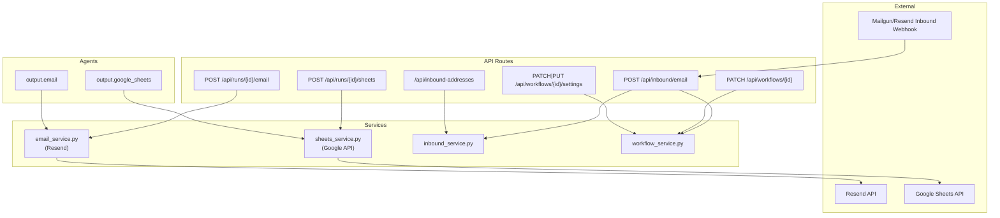

# Backend V2 — One-Shot Build Prompt for Cursor

> Transcribed from `backend-v2-opus4.6/` screenshots (Aug 8, 2026). Source images gitignored.

> **What this is:** A single, self-contained prompt you can paste into Cursor to implement all V2 backend features for AgentFlow. It includes the complete current architecture analysis, every new file, every modification, database migrations, and the exact code for each feature.
>
> **How to use:** Copy everything from `--- START PROMPT ---` to `--- END PROMPT ---` and paste it into Cursor as a single message. Cursor will have all the context it needs.

---

## --- START PROMPT ---

You are adding V2 features to the AgentFlow backend. The codebase is at `github.com/kabirrao2002/agentflow` on the `develop` branch. You are working in `backend/`.

### Stack

- Python 3.11+
- FastAPI 0.115.6 (Uvicorn 0.34.0)
- Pydantic + pydantic-settings
- Groq LLM (`llama-3.3-70b-versatile`) via `groq` SDK
- Supabase (Postgres + Storage) — with in-memory fallback
- PyMuPDF + Tesseract for document extraction
- slowapi for rate limiting
- tenacity for LLM retry
- Tests: pytest + pytest-asyncio

### Current Architecture (DO NOT break any of this)

```
backend/
├── app/
│   ├── main.py              # FastAPI app, CORS, lifespan, route registration
│   ├── config.py            # pydantic-settings (env vars)
│   ├── rate_limit.py        # slowapi limiter
│   ├── logging_config.py    # structured logging
│   │
│   ├── agents/
│   │   ├── core/
│   │   │   ├── base.py      # StepHandler ABC + StepResult dataclass
│   │   │   ├── context.py   # WorkflowContext (shared state between steps)
│   │   │   └── registry.py  # register_agent(), get_handler(), get_agent_catalog()
│   │   └── handlers/
│   │       ├── __init__.py  # imports all handler modules (auto-registration)
│   │       ├── output/
│   │       │   ├── __init__.py
│   │       │   └── formatter.py   # output.formatter — CSV/JSON final format
│   │       ├── processors/
│   │       │   ├── ocr.py         # processor.ocr — Tesseract OCR
│   │       │   └── text_extract.py # processor.text_extract — PyMuPDF
│   │       └── transforms/
│   │           ├── field_extractor.py    # transform.field_extractor — LLM extraction
│   │           ├── pipeline_refiner.py   # transform.pipeline_refiner — chat refinement
│   │           └── rules.py              # transform.rules — flag/filter rules
│   │
│   ├── api/
│   │   ├── dependencies.py  # FastAPI Depends() providers + Annotated aliases
│   │   ├── mappers/         # domain ↔ API response mappers
│   │   └── routes/
│   │       ├── admin.py
│   │       ├── auth.py      # POST /api/auth/session (email sign-in)
│   │       ├── extract.py   # POST /api/extract (direct extraction)
│   │       ├── health.py    # GET /api/health
│   │       ├── pipeline.py  # POST /api/pipeline/create (plan only)
│   │       ├── runs.py      # POST /api/runs/adhoc, /template, /{id}/refine, GET /{id}
│   │       ├── template_versions.py  # GET/POST template version routes (run + workflow)
│   │       ├── templates.py # GET /api/templates (catalog)
│   │       ├── upload.py    # POST /api/upload (file upload)
│   │       ├── uploads.py   # GET /api/uploads/{id}/documents
│   │       ├── users.py     # GET/POST user routes
│   │       └── workflows.py # POST/GET workflow CRUD + run
│   │
│   ├── models/
│   │   ├── api/             # Pydantic request/response models
│   │   └── domain/          # Dataclass domain models
│   │
│   ├── persistence/
│   │   ├── protocols.py     # DataRepository, TemplateRepository, DocumentStorageRepository, UserTemplateStorageRepository
│   │   ├── registry.py      # get_repository(), get_document_store(), etc.
│   │   ├── memory_repository.py
│   │   ├── supabase_repository.py
│   │   ├── serialization.py
│   │   ├── versioned_persist.py
│   │   ├── documents/       # DocumentStorageRepository impls (local + supabase)
│   │   ├── templates/       # TemplateRepository impls + bootstrap seeder
│   │   └── user_templates/  # UserTemplateStorageRepository impls
│   │
│   ├── services/
│   │   ├── auth/            # AuthService (email-based sign-in)
│   │   ├── documents/       # UploadService, upload_loader
│   │   ├── extractions/     # LLM field extraction logic
│   │   ├── llm/             # groq_client (complete_json)
│   │   ├── pipeline/        # planner.py, runner.py, refine_service.py, pipeline_refiner.py
│   │   ├── templates/       # TemplateService, UserTemplateVersionService, master refine
│   │   ├── users/           # UserService
│   │   └── workflows/       # WorkflowService (CRUD + run + version management)
│   │
│   ├── templates/           # Built-in pipeline template definitions (Python dicts)
│   └── validation/          # task_input sanitization
│
├── supabase/
│   ├── schema.sql           # Full DB schema
│   └── migrations/          # Incremental migrations
│
├── tests/
├── requirements.txt
├── Dockerfile
└── .env.example
```

### Current Domain Models

**WorkflowContext** (shared state between step handlers):

```python
@dataclass
class WorkflowContext:
    upload_id: str
    task_description: str = ""
    data: dict[str, Any] = field(default_factory=dict)
    # data["documents"] = list of doc dicts
    # data["rows"] = extracted rows (after field_extractor)
    # data["output"] = final formatted output (after formatter)
```

**StepHandler** (base class for all agents):

```python
class StepHandler(ABC):
    @abstractmethod
    async def execute(self, ctx: WorkflowContext, config: dict[str, Any]) -> StepResult:
        pass

@dataclass
class StepResult:
    output: dict[str, Any]
```

**Agent Registry** pattern:

```python
register_agent(
    "agent_type.name",
    name="Human Name",
    description="What it does (planner reads this)",
    example_config={"key": "value"},
    handler=HandlerInstance(),
)
```

**Current registered agents:**

- `processor.ocr` — Tesseract OCR for images/scanned PDFs
- `processor.text_extract` — PyMuPDF for digital PDFs
- `transform.field_extractor` — LLM-based field extraction
- `transform.rules` — flag/filter business rules
- `transform.pipeline_refiner` — chat-driven pipeline refinement
- `output.formatter` — CSV/JSON final output formatting

**Current API endpoints:**

- `GET /api/health`
- `POST /api/auth/session` (email sign-in; plan doc originally listed `/signin` — actual route is `/session`)
- `GET/POST /api/users`
- `POST /api/upload` (file upload + returns upload_id)
- `GET /api/uploads/{id}/documents`
- `GET /api/uploads/{id}/documents/{doc_id}` (raw file download)
- `POST /api/pipeline/create` (plan only, no execution)
- `POST /api/runs/adhoc` (plan + execute in background)
- `POST /api/runs/template` (run from template)
- `POST /api/runs` (run explicit steps)
- `GET /api/runs/{id}` (poll for status)
- `POST /api/runs/{id}/refine` (chat refinement + child run)
- `GET /api/runs/{id}/template-versions` ← **REMOVE in V2**
- `GET /api/runs/{id}/template-versions/{version_id}` ← **REMOVE in V2**
- `POST /api/runs/{id}/revert` ← **REMOVE in V2**
- `GET /api/templates`
- `GET /api/workflows`, `POST /api/workflows`
- `POST /api/workflows/from-run/{run_id}`
- `GET /api/workflows/{id}`, `GET /api/workflows/{id}/runs`
- `POST /api/workflows/{id}/runs` (run workflow on new upload)
- `GET /api/workflows/{id}/template-versions`
- `GET /api/workflows/{id}/template-versions/{version_id}`
- `POST /api/workflows/{id}/revert`

**Current DB tables (Supabase):**

- `users` (id, name, email, created_at)
- `workflows` (id, user_id, name, description, source, task_description, parent_template_id, current_template_version_id, extraction_prompt, created_at)
- `workflow_steps` (id, workflow_id, step_order, agent_type, config, reason)
- `workflow_runs` (id, workflow_id, upload_id, document_ids, task_description, status, planned_steps, result, error_message, parent_run_id, template_id, current_template_version_id, extraction_prompt, cached_documents, refine_summary, created_at, completed_at)
- `workflow_step_runs` (id, run_id, step_order, agent_type, status, output, error_message)
- `pipeline_templates` (id, name, description, icon, category, default_task, fields, extraction_instructions, rules, output_format, suggested_steps, sort_order, is_active, ...)
- `user_template_versions` (id, scope_type, scope_id, parent_version_id, template_id, storage_key, refine_summary, version_number, created_at)
- `refinement_events` (id, template_id, scope_type, scope_id, version_id, parent_version_id, user_message, refine_summary, created_at)

**Current Persistence Protocol:**

```python
class DataRepository(Protocol):
    def save_user(self, user: UserRecord) -> None: ...
    def get_user(self, user_id: str) -> Optional[UserRecord]: ...
    def get_user_by_email(self, email: str) -> Optional[UserRecord]: ...
    def list_users(self) -> list[UserRecord]: ...
    def save_run(self, run: RunResult) -> None: ...
    def get_run(self, run_id: str) -> Optional[RunResult]: ...
    def list_runs_by_workflow(self, workflow_id: str) -> list[RunResult]: ...
    def save_workflow(self, workflow: WorkflowRecord) -> None: ...
    def get_workflow(self, workflow_id: str) -> Optional[WorkflowRecord]: ...
    def list_workflows(self, user_id: Optional[str] = None) -> list[WorkflowSummary]: ...
    def save_template_version(self, version: UserTemplateVersionRecord) -> None: ...
    def get_template_version(self, version_id: str) -> Optional[UserTemplateVersionRecord]: ...
    def list_template_versions(self, scope_type: str, scope_id: str) -> list[UserTemplateVersionRecord]: ...
    def save_refinement_event(self, event: RefinementEvent) -> None: ...
    def list_refinement_events(self, template_id: Optional[str] = None, limit: int = 100) -> list[RefinementEvent]: ...
```

**Current Dependency Injection (`dependencies.py`):**

```python
RepoDep = Annotated[DataRepository, Depends(get_repo)]
DocStoreDep = Annotated[DocumentStorageRepository, Depends(get_doc_store)]
UserServiceDep = Annotated[UserService, Depends(get_user_service)]
WorkflowServiceDep = Annotated[WorkflowService, Depends(get_workflow_service)]
UploadServiceDep = Annotated[UploadService, Depends(get_upload_service)]
AuthServiceDep = Annotated[AuthService, Depends(get_auth_service)]
RefineServiceDep = Annotated[RefineService, Depends(get_refine_service)]
VersionServiceDep = Annotated[UserTemplateVersionService, Depends(get_version_service)]
TemplateServiceDep = Annotated[TemplateService, Depends(get_template_service)]
```

### Service Architecture (V2 additions)



---

## V2 FEATURES TO IMPLEMENT

There are **6 backend features** + **1 auth prerequisite fix** + versioning simplification:

| # | Feature | Summary |
|---|---------|---------|
| 0 | Auth fix | Fix `POST /api/auth/session` 500 on `get_user_by_email` |
| 1 | Outbound Email | Resend — HTML table + CSV attachment |
| 2 | Google Sheets | Service account push to spreadsheet tab |
| 3 | Inbound Email | Mailgun webhook → auto-run workflow |
| 4 | Workflow PATCH | Update workflow from refined run (new version) |
| 5 | Workflow Settings | Update metadata + delivery defaults |
| 6 | Versioning | Versions on workflows only; remove run-level version endpoints |

### Frontend V2 compatibility notes

The V2 frontend (`frontend/src/lib/api.ts`) already calls these stub endpoints. **Match these request shapes:**

| Frontend function | Method | Path | Request body |
|-------------------|--------|------|--------------|
| `updateWorkflowFromRun` | `PATCH` | `/api/workflows/{id}` | `{ from_run_id, version_name? }` |
| `updateWorkflowSettings` | `PATCH` | `/api/workflows/{id}/settings` | `{ name?, description?, default_email?, default_sheets_url? }` |
| `emailResults` | `POST` | `/api/runs/{id}/email` | `{ to, subject }` |
| `pushToSheets` | `POST` | `/api/runs/{id}/sheets` | `{ url, sheet_name }` |

Implement Pydantic models with **field aliases** so both canonical names (`run_id`, `to_email`, `spreadsheet_url`) and frontend names (`from_run_id`, `to`, `url`) work. Accept **both PATCH and PUT** for workflow settings (frontend uses PATCH).

---

### FEATURE 0: Auth Fix — `POST /api/auth/session` (Prerequisite)

**Problem:** `POST /api/auth/session` returns 500 when Supabase `get_user_by_email` is called. The frontend account page cannot sign in.

**Root cause:** `supabase_repository.get_user_by_email` uses `.limit(1).maybe_single()` which can raise in supabase-py when zero rows match (instead of returning `None`).

**Fix in `app/persistence/supabase_repository.py`:**

```python
def get_user_by_email(self, email: str) -> Optional[UserRecord]:
    normalized = email.strip().lower()
    if not normalized:
        return None
    resp = (
        _get_client()
        .table("users")
        .select("*")
        .eq("email", normalized)
        .order("created_at", desc=True)
        .limit(1)
        .execute()
    )
    rows = resp.data or []
    if not rows:
        return None
    row = rows[0]
    return UserRecord(
        user_id=row["id"],
        name=row["name"],
        email=row.get("email") or "",
        created_at=row.get("created_at"),
    )
```

Also ensure the `users.email` column exists in production Supabase (see `schema.sql`). Add a test in `tests/test_auth.py` that `get_user_by_email` returns `None` for unknown email without raising.

---

### FEATURE 1: Outbound Email via Resend

> Send pipeline results as HTML table + CSV attachment to any email address.

**New dependencies:** `resend` (add to `requirements.txt`)

**New env vars (add to `config.py` + `.env.example`):**

```python
# config.py
resend_api_key: str = ""
resend_from_email: str = "onboarding@resend.dev"
```

```env
# .env.example
# Email delivery (Resend — free tier 3000/month)
RESEND_API_KEY=re_your_api_key_here
RESEND_FROM_EMAIL=onboarding@resend.dev
```

**Files to create:**

#### 1a. `app/models/domain/email.py`

```python
"""Email delivery domain models."""

from dataclasses import dataclass
from typing import Any, Optional


@dataclass
class EmailRequest:
    to_email: str
    subject: str
    rows: list[dict[str, Any]]
    pipeline_name: str = ""
    doc_count: int = 0


@dataclass
class EmailResult:
    email_id: str
    status: str  # sent | failed
    error_message: Optional[str] = None


class EmailDeliveryError(Exception):
    """Raised when email sending fails."""


@dataclass
class InboundAddress:
    address_id: str  # unique prefix: "flow-abc123"
    full_address: str  # "flow-abc123@ingest.agentflow.app"
    user_id: str
    workflow_id: str
    created_at: Optional[str] = None


class InboundAddressNotFoundError(Exception):
    """Raised when inbound address doesn't map to a user/workflow."""
```

#### 1b. `app/models/api/email.py`

```python
"""Email API request/response models."""

from pydantic import BaseModel, EmailStr, Field


class EmailResultsRequest(BaseModel):
    to_email: EmailStr = Field(validation_alias="to")
    subject: str = "Your AgentFlow Results"

    model_config = {"populate_by_name": True}


class EmailResultsResponse(BaseModel):
    status: str
    email_id: str
    message: str
```

#### 1c. `app/services/email/__init__.py`

```python
# Email services package
```

#### 1d. `app/services/email/email_service.py`

```python
"""Email delivery service — sends pipeline results via Resend.

RULES:
- Raises EmailDeliveryError on failure (domain exception, NOT HTTPException)
- Never imports FastAPI types
- Uses app.config.settings for all config values
"""

import base64
import csv
import io
import json
import logging
from typing import Any

import resend

from app.config import settings
from app.models.domain.email import EmailDeliveryError, EmailRequest, EmailResult

logger = logging.getLogger("email")


def _rows_to_html_table(rows: list[dict[str, Any]]) -> str:
    """Convert list of dicts to a styled HTML table for email body."""
    if not rows:
        return "<p>No data extracted.</p>"

    headers = list(rows[0].keys())
    skip = {"flags", "document_id"}
    headers = [h for h in headers if h not in skip]

    html = (
        '<table style="border-collapse:collapse;width:100%;'
        'font-family:Arial,sans-serif;font-size:14px;">\n'
        '<thead><tr style="background-color:#0D9488;color:#fff;">\n'
    )
    for h in headers:
        label = h.replace("_", " ").title()
        html += (
            f'<th style="padding:10px 14px;text-align:left;'
            f'border:1px solid #ddd;">{label}</th>\n'
        )
    html += "</tr></thead>\n<tbody>\n"

    for i, row in enumerate(rows):
        bg = "#f0f0f0" if i % 2 == 0 else "#ffffff"
        html += f'<tr style="background-color:{bg};">\n'
        for h in headers:
            val = row.get(h, "")
            if isinstance(val, (dict, list)):
                val = json.dumps(val, ensure_ascii=False)
            html += f'<td style="padding:8px 14px;border:1px solid #ddd;">{val}</td>\n'
        html += "</tr>\n"

    html += "</tbody></table>"
    return html


def _rows_to_csv_bytes(rows: list[dict[str, Any]]) -> bytes:
    """Convert list of dicts to CSV bytes for attachment."""
    if not rows:
        return b""

    skip = {"flags"}
    headers = [k for k in rows[0].keys() if k not in skip]

    flag_keys: list[str] = []
    for row in rows:
        for flag in row.get("flags", {}):
            if flag not in flag_keys:
                flag_keys.append(flag)
    all_headers = headers + flag_keys

    output = io.StringIO()
    writer = csv.DictWriter(output, fieldnames=all_headers, extrasaction="ignore")
    writer.writeheader()
    for row in rows:
        flat = {}
        for k in headers:
            v = row.get(k)
            if isinstance(v, (dict, list)):
                v = json.dumps(v, ensure_ascii=False)
            flat[k] = v
        flat.update(row.get("flags", {}))
        writer.writerow(flat)

    return output.getvalue().encode("utf-8")


async def send_results_email(request: EmailRequest) -> EmailResult:
    """Send extraction results via email.

    Body: HTML table of results
    Attachment: CSV file
    Raises EmailDeliveryError on failure.
    """
    if not settings.resend_api_key:
        raise EmailDeliveryError("RESEND_API_KEY is not configured. Add it to .env")

    resend.api_key = settings.resend_api_key

    html_table = _rows_to_html_table(request.rows)
    csv_bytes = _rows_to_csv_bytes(request.rows)

    html_body = f"""
    <div style="font-family:Arial,sans-serif;max-width:800px;margin:0 auto;">
      <h2 style="color:#1C1917;">
        {request.pipeline_name or "AgentFlow"} — Results
      </h2>
      <p style="color:#78716C;">
        Processed <strong>{request.doc_count}</strong> document(s) —
        Extracted <strong>{len(request.rows)}</strong> row(s)
      </p>
      <hr style="border:none;border-top:1px solid #E7E5E4;margin:16px 0;">
      {html_table}
      <hr style="border:none;border-top:1px solid #E7E5E4;margin:16px 0;">
      <p style="color:#A8A29E;font-size:12px;">
        CSV file attached · Sent by AgentFlow
      </p>
    </div>
    """

    try:
        logger.info("Sending results email to %s", request.to_email)
        response = resend.Emails.send({
            "from": settings.resend_from_email,
            "to": [request.to_email],
            "subject": request.subject,
            "html": html_body,
            "attachments": [
                {
                    "filename": "results.csv",
                    "content": base64.b64encode(csv_bytes).decode("utf-8"),
                    "content_type": "text/csv",
                }
            ],
        })
        email_id = response.get("id", "unknown")
        logger.info("Email sent — id=%s", email_id)
        return EmailResult(email_id=email_id, status="sent")
    except Exception as e:
        logger.error("Email delivery failed: %s", str(e))
        raise EmailDeliveryError(f"Failed to send email: {e}") from e
```

#### 1e. `app/agents/handlers/output/email_agent.py`

```python
"""Send results via email — registered as output.email agent."""

from typing import Any

from app.agents.core.base import StepHandler, StepResult
from app.agents.core.context import WorkflowContext
from app.agents.core.registry import register_agent
from app.models.domain.email import EmailRequest
from app.services.email.email_service import send_results_email


class EmailHandler(StepHandler):
    async def execute(
        self,
        ctx: WorkflowContext,
        config: dict[str, Any],
    ) -> StepResult:
        to_email = config.get("to_email")
        if not to_email:
            raise ValueError("email agent config requires 'to_email'")

        rows = ctx.data.get("rows", [])
        if not rows:
            raise ValueError("No rows available — run field_extractor first")

        request = EmailRequest(
            to_email=to_email,
            subject=config.get("subject", "Your AgentFlow Results"),
            rows=rows,
            pipeline_name=ctx.task_description[:80],
            doc_count=len(ctx.data.get("documents", [])),
        )
        result = await send_results_email(request)

        return StepResult(
            output={
                "email_sent_to": to_email,
                "email_id": result.email_id,
                "row_count": len(rows),
            }
        )


register_agent(
    "output.email",
    name="Email Agent",
    description=(
        "Send extraction results via email. "
        "Includes an HTML table in the body and a CSV attachment. "
        "Use when the user says 'email', 'send to', or 'deliver to'."
    ),
    example_config={
        "to_email": "user@example.com",
        "subject": "Invoice Extraction Results",
    },
    handler=EmailHandler(),
)
```

#### 1f. `app/api/routes/email.py`

```python
"""Email delivery route — send run results to an email address."""

from fastapi import APIRouter, HTTPException

from app.api.dependencies import RepoDep
from app.models.api.email import EmailResultsRequest, EmailResultsResponse
from app.models.domain.email import EmailDeliveryError, EmailRequest
from app.services.email.email_service import send_results_email

router = APIRouter(prefix="/api/runs", tags=["email"])


@router.post("/{run_id}/email", response_model=EmailResultsResponse)
async def email_run_results(
    run_id: str,
    body: EmailResultsRequest,
    repo: RepoDep,
) -> EmailResultsResponse:
    """Send a completed run's results via email."""
    run = repo.get_run(run_id)
    if run is None:
        raise HTTPException(status_code=404, detail=f"Run not found: {run_id}")
    if run.status != "completed":
        raise HTTPException(status_code=400, detail="Run is not completed yet")

    result_data = run.result or {}
    rows = result_data.get("rows", [])
    if not rows:
        raise HTTPException(status_code=400, detail="Run has no result rows")

    request = EmailRequest(
        to_email=str(body.to_email),
        subject=body.subject,
        rows=rows,
        pipeline_name=run.task_description[:80],
        doc_count=len(run.document_ids),
    )

    try:
        result = await send_results_email(request)
    except EmailDeliveryError as e:
        raise HTTPException(status_code=502, detail=str(e)) from e

    return EmailResultsResponse(
        status="sent",
        email_id=result.email_id,
        message=f"Results emailed to {body.to_email}",
    )
```

#### 1g. Wire it up

**Modify `app/agents/handlers/output/__init__.py`** — add import:

```python
from app.agents.handlers.output import email_agent, formatter  # noqa: F401
```

**Modify `app/main.py`** — add:

```python
from app.api.routes import ..., email
app.include_router(email.router)
```

**Modify `requirements.txt`** — add:

```
resend>=2.0.0
```

#### 1h. Test — `tests/test_email_agent.py`

```python
import pytest
from unittest.mock import AsyncMock, patch

from app.agents.core.context import WorkflowContext
from app.agents.handlers.output.email_agent import EmailHandler
from app.models.domain.email import EmailResult


@pytest.mark.asyncio
async def test_email_agent_sends():
    ctx = WorkflowContext(upload_id="test", task_description="Extract invoices")
    ctx.data["rows"] = [{"vendor": "Acme", "amount": 5000}]
    ctx.data["documents"] = [{"document_id": "d1"}]
    config = {"to_email": "test@example.com", "subject": "Test"}

    mock_result = EmailResult(email_id="re_123", status="sent")
    with patch(
        "app.agents.handlers.output.email_agent.send_results_email",
        new_callable=AsyncMock,
        return_value=mock_result,
    ):
        handler = EmailHandler()
        result = await handler.execute(ctx, config)

    assert result.output["email_sent_to"] == "test@example.com"
    assert result.output["row_count"] == 1


@pytest.mark.asyncio
async def test_email_agent_requires_to_email():
    ctx = WorkflowContext(upload_id="test")
    ctx.data["rows"] = [{"vendor": "Acme"}]

    handler = EmailHandler()
    with pytest.raises(ValueError, match="to_email"):
        await handler.execute(ctx, {})


@pytest.mark.asyncio
async def test_email_agent_requires_rows():
    ctx = WorkflowContext(upload_id="test")
    ctx.data["rows"] = []

    handler = EmailHandler()
    with pytest.raises(ValueError, match="No rows"):
        await handler.execute(ctx, {"to_email": "test@example.com"})
```

---

### FEATURE 2: Google Sheets Push (Service Account)

> Push extraction results directly into a Google Sheet tab.

**New dependencies:** `google-api-python-client`, `google-auth` (add to `requirements.txt`)

**New env vars:**

```python
# config.py
google_service_account_json: str = ""  # Path to JSON key file or raw JSON string
```

```env
# .env.example
# Google Sheets (service account)
GOOGLE_SERVICE_ACCOUNT_JSON={"type":"service_account","project_id":"..."}
```

**Files to create:**

#### 2a. `app/models/domain/sheets.py`

```python
"""Google Sheets domain models."""

from dataclasses import dataclass


@dataclass
class SheetsPushResult:
    spreadsheet_id: str
    sheet_name: str
    rows_written: int


class SheetsError(Exception):
    """Raised when Google Sheets operation fails."""
```

#### 2b. `app/models/api/sheets.py`

```python
"""Google Sheets API request/response models."""

from pydantic import BaseModel, Field


class SheetsPushRequest(BaseModel):
    spreadsheet_url: str = Field(validation_alias="url")
    sheet_name: str = "AgentFlow Results"

    model_config = {"populate_by_name": True}


class SheetsPushResponse(BaseModel):
    status: str
    spreadsheet_id: str
    sheet_name: str
    rows_written: int
```

#### 2c. `app/services/sheets/__init__.py`

```python
# Google Sheets services package
```

#### 2d. `app/services/sheets/sheets_service.py`

```python
"""Google Sheets push service — write extraction rows to a spreadsheet."""

import json
import logging
from typing import Any

from google.oauth2.service_account import Credentials
from googleapiclient.discovery import build

from app.config import settings
from app.models.domain.sheets import SheetsError, SheetsPushResult

logger = logging.getLogger("sheets")

SCOPES = ["https://www.googleapis.com/auth/spreadsheets"]


def _get_service():
    """Build authenticated Sheets API client."""
    creds_json = settings.google_service_account_json
    if not creds_json:
        raise SheetsError("GOOGLE_SERVICE_ACCOUNT_JSON not configured")

    if creds_json.startswith("{"):
        info = json.loads(creds_json)
    else:
        with open(creds_json) as f:
            info = json.load(f)

    creds = Credentials.from_service_account_info(info, scopes=SCOPES)
    return build("sheets", "v4", credentials=creds)


def _extract_sheet_id(url_or_id: str) -> str:
    """Extract spreadsheet ID from URL or raw ID."""
    if "/spreadsheets/d/" in url_or_id:
        return url_or_id.split("/spreadsheets/d/")[1].split("/")[0]
    return url_or_id


async def push_rows_to_sheet(
    spreadsheet_url: str,
    rows: list[dict[str, Any]],
    sheet_name: str = "AgentFlow Results",
) -> SheetsPushResult:
    """Write rows to a Google Sheet.

    Creates a new tab if sheet_name doesn't exist.
    User must share the spreadsheet with the service account email.
    """
    if not rows:
        raise SheetsError("No rows to push")

    service = _get_service()
    spreadsheet_id = _extract_sheet_id(spreadsheet_url)

    skip = {"flags", "document_id"}
    headers = [k for k in rows[0].keys() if k not in skip]

    flag_keys: list[str] = []
    for row in rows:
        for flag in row.get("flags", {}):
            if flag not in flag_keys:
                flag_keys.append(flag)
    all_headers = headers + flag_keys

    values = [all_headers]
    for row in rows:
        row_values = []
        for h in headers:
            val = row.get(h, "")
            if isinstance(val, (dict, list)):
                val = json.dumps(val)
            row_values.append(str(val) if val is not None else "")
        for flag in flag_keys:
            row_values.append(str(row.get("flags", {}).get(flag, "")))
        values.append(row_values)

    try:
        # Try to add a new sheet tab
        try:
            service.spreadsheets().batchUpdate(
                spreadsheetId=spreadsheet_id,
                body={
                    "requests": [
                        {"addSheet": {"properties": {"title": sheet_name}}}
                    ]
                },
            ).execute()
        except Exception:
            pass  # Tab may already exist

        service.spreadsheets().values().update(
            spreadsheetId=spreadsheet_id,
            range=f"{sheet_name}!A1",
            valueInputOption="USER_ENTERED",
            body={"values": values},
        ).execute()

        logger.info("Pushed %d rows to sheet %s", len(rows), spreadsheet_id)
        return SheetsPushResult(
            spreadsheet_id=spreadsheet_id,
            sheet_name=sheet_name,
            rows_written=len(rows),
        )
    except SheetsError:
        raise
    except Exception as e:
        logger.error("Sheets push failed: %s", str(e))
        raise SheetsError(f"Failed to push to Google Sheets: {e}") from e
```

#### 2e. `app/agents/handlers/output/sheets_agent.py`

```python
"""Push results to Google Sheets — registered as output.google_sheets."""

from typing import Any

from app.agents.core.base import StepHandler, StepResult
from app.agents.core.context import WorkflowContext
from app.agents.core.registry import register_agent
from app.services.sheets.sheets_service import push_rows_to_sheet


class SheetsHandler(StepHandler):
    async def execute(
        self,
        ctx: WorkflowContext,
        config: dict[str, Any],
    ) -> StepResult:
        spreadsheet_url = config.get("spreadsheet_url")
        if not spreadsheet_url:
            raise ValueError("google_sheets config requires 'spreadsheet_url'")

        rows = ctx.data.get("rows", [])
        if not rows:
            raise ValueError("No rows available — run field_extractor first")

        result = await push_rows_to_sheet(
            spreadsheet_url,
            rows,
            config.get("sheet_name", "AgentFlow Results"),
        )

        return StepResult(
            output={
                "spreadsheet_id": result.spreadsheet_id,
                "sheet_name": result.sheet_name,
                "rows_written": result.rows_written,
            }
        )


register_agent(
    "output.google_sheets",
    name="Google Sheets Agent",
    description=(
        "Push extraction results to a Google Sheet. "
        "Use when user says 'Google Sheets', 'spreadsheet', or 'push to sheets'."
    ),
    example_config={
        "spreadsheet_url": "https://docs.google.com/spreadsheets/d/...",
        "sheet_name": "Invoices Q3",
    },
    handler=SheetsHandler(),
)
```

#### 2f. `app/api/routes/sheets.py`

```python
"""Google Sheets push route."""

from fastapi import APIRouter, HTTPException

from app.api.dependencies import RepoDep
from app.models.api.sheets import SheetsPushRequest, SheetsPushResponse
from app.models.domain.sheets import SheetsError
from app.services.sheets.sheets_service import push_rows_to_sheet

router = APIRouter(prefix="/api/runs", tags=["sheets"])


@router.post("/{run_id}/sheets", response_model=SheetsPushResponse)
async def push_to_sheets(
    run_id: str,
    body: SheetsPushRequest,
    repo: RepoDep,
) -> SheetsPushResponse:
    """Push a completed run's results to a Google Sheet."""
    run = repo.get_run(run_id)
    if run is None:
        raise HTTPException(status_code=404, detail=f"Run not found: {run_id}")
    if run.status != "completed":
        raise HTTPException(status_code=400, detail="Run is not completed yet")

    result_data = run.result or {}
    rows = result_data.get("rows", [])
    if not rows:
        raise HTTPException(status_code=400, detail="Run has no result rows")

    try:
        result = await push_rows_to_sheet(
            body.spreadsheet_url, rows, body.sheet_name
        )
    except SheetsError as e:
        raise HTTPException(status_code=502, detail=str(e)) from e

    return SheetsPushResponse(
        status="pushed",
        spreadsheet_id=result.spreadsheet_id,
        sheet_name=result.sheet_name,
        rows_written=result.rows_written,
    )
```

#### 2g. Wire it up

**Modify `app/agents/handlers/output/__init__.py`:**

```python
from app.agents.handlers.output import email_agent, formatter, sheets_agent  # noqa: F401
```

**Modify `app/main.py`:**

```python
from app.api.routes import ..., sheets
app.include_router(sheets.router)
```

**Modify `requirements.txt`:**

```
google-api-python-client>=2.100.0
google-auth>=2.20.0
```

#### 2h. Test — `tests/test_sheets_agent.py`

```python
import pytest
from unittest.mock import AsyncMock, patch

from app.agents.core.context import WorkflowContext
from app.agents.handlers.output.sheets_agent import SheetsHandler
from app.models.domain.sheets import SheetsPushResult


@pytest.mark.asyncio
async def test_sheets_agent_pushes():
    ctx = WorkflowContext(upload_id="test", task_description="Extract invoices")
    ctx.data["rows"] = [{"vendor": "Acme", "amount": 5000}]
    config = {
        "spreadsheet_url": "https://docs.google.com/spreadsheets/d/abc123/edit",
        "sheet_name": "Test Sheet",
    }

    mock_result = SheetsPushResult(
        spreadsheet_id="abc123", sheet_name="Test Sheet", rows_written=1
    )
    with patch(
        "app.agents.handlers.output.sheets_agent.push_rows_to_sheet",
        new_callable=AsyncMock,
        return_value=mock_result,
    ):
        handler = SheetsHandler()
        result = await handler.execute(ctx, config)

    assert result.output["spreadsheet_id"] == "abc123"
    assert result.output["rows_written"] == 1


@pytest.mark.asyncio
async def test_sheets_agent_requires_url():
    ctx = WorkflowContext(upload_id="test")
    ctx.data["rows"] = [{"vendor": "Acme"}]

    handler = SheetsHandler()
    with pytest.raises(ValueError, match="spreadsheet_url"):
        await handler.execute(ctx, {})


@pytest.mark.asyncio
async def test_sheets_agent_requires_rows():
    ctx = WorkflowContext(upload_id="test")
    ctx.data["rows"] = []

    handler = SheetsHandler()
    with pytest.raises(ValueError, match="No rows"):
        await handler.execute(ctx, {"spreadsheet_url": "https://..."})
```

---

### FEATURE 3: Inbound Email (Auto-Process Forwarded Emails)

> Users forward emails to a unique AgentFlow address. Attachments are auto-extracted and processed via their saved workflow.

**New env vars:**

```python
# config.py
inbound_email_domain: str = "ingest.agentflow.app"
inbound_webhook_secret: str = ""  # Mailgun signing key for verification
```

**Persistence additions — add to `DataRepository` protocol in `protocols.py`:**

```python
def save_inbound_address(self, address: "InboundAddress") -> None: ...
def get_inbound_address(self, address_id: str) -> Optional["InboundAddress"]: ...
def list_inbound_addresses(self, user_id: str) -> list["InboundAddress"]: ...
def delete_inbound_address(self, address_id: str) -> None: ...
```

Also add to `DocumentStorageRepository`:

```python
async def save_document_bytes(
    self, upload_id: str, filename: str, content: bytes, content_type: str
) -> StoredDocument: ...
```

Implement these methods in both `memory_repository.py` and `supabase_repository.py`.

#### 3a. `app/services/email/inbound_service.py`

```python
"""Inbound email processing — parse webhook, extract attachments, run workflow."""

import logging
import uuid
from typing import Any

from app.config import settings
from app.models.domain.email import InboundAddress, InboundAddressNotFoundError
from app.persistence.protocols import DataRepository, DocumentStorageRepository

logger = logging.getLogger("inbound")


class InboundEmailService:
    def __init__(
        self,
        repo: DataRepository,
        doc_store: DocumentStorageRepository,
    ) -> None:
        self._repo = repo
        self._doc_store = doc_store

    def create_inbound_address(
        self,
        user_id: str,
        workflow_id: str,
    ) -> InboundAddress:
        """Generate a unique inbound email address for a workflow."""
        prefix = f"flow-{uuid.uuid4().hex[:8]}"
        address = InboundAddress(
            address_id=prefix,
            full_address=f"{prefix}@{settings.inbound_email_domain}",
            user_id=user_id,
            workflow_id=workflow_id,
        )
        self._repo.save_inbound_address(address)
        logger.info(
            "Created inbound address %s for workflow %s",
            address.full_address,
            workflow_id,
        )
        return address

    def list_addresses(self, user_id: str) -> list[InboundAddress]:
        return self._repo.list_inbound_addresses(user_id)

    def delete_address(self, address_id: str) -> None:
        self._repo.delete_inbound_address(address_id)

    def resolve_address(self, recipient: str) -> InboundAddress:
        """Look up which user/workflow an inbound address maps to."""
        address_id = recipient.split("@")[0]
        address = self._repo.get_inbound_address(address_id)
        if address is None:
            raise InboundAddressNotFoundError(
                f"No workflow mapped to {recipient}"
            )
        return address

    async def process_inbound(
        self,
        recipient: str,
        sender: str,
        attachments: list[dict[str, Any]],
    ) -> tuple[str, str, str]:
        """Process an inbound email.

        1. Resolve recipient → user + workflow
        2. Save attachments as upload

        Returns (upload_id, workflow_id, sender_email).
        """
        address = self.resolve_address(recipient)

        if not attachments:
            logger.warning("Inbound from %s has no attachments", sender)
            raise ValueError("Email has no attachments to process")

        upload_id = str(uuid.uuid4())
        for att in attachments:
            await self._doc_store.save_document_bytes(
                upload_id=upload_id,
                filename=att["filename"],
                content=att["content"],
                content_type=att["content_type"],
            )

        logger.info(
            "Inbound email from %s → workflow %s, upload %s",
            sender,
            address.workflow_id,
            upload_id,
        )
        return upload_id, address.workflow_id, sender
```

#### 3b. `app/api/routes/inbound.py`

```python
"""Inbound email webhook — receives forwarded emails from Mailgun/Resend."""

import hashlib
import hmac

from fastapi import APIRouter, BackgroundTasks, HTTPException, Request

from app.api.dependencies import InboundEmailServiceDep, WorkflowServiceDep
from app.config import settings
from app.services.pipeline.runner import execute_run

router = APIRouter(prefix="/api/inbound", tags=["inbound"])


def _verify_mailgun_signature(
    token: str, timestamp: str, signature: str
) -> bool:
    """Verify Mailgun webhook signature."""
    if not settings.inbound_webhook_secret:
        return True  # Skip in dev
    hmac_digest = hmac.new(
        key=settings.inbound_webhook_secret.encode(),
        msg=f"{timestamp}{token}".encode(),
        digestmod=hashlib.sha256,
    ).hexdigest()
    return hmac.compare_digest(signature, hmac_digest)


@router.post("/email")
async def receive_inbound_email(
    request: Request,
    background_tasks: BackgroundTasks,
    inbound: InboundEmailServiceDep,
    workflows: WorkflowServiceDep,
):
    """Mailgun/Resend posts here when email arrives at *@ingest.agentflow.app."""
    form = await request.form()

    if not _verify_mailgun_signature(
        form.get("token", ""),
        form.get("timestamp", ""),
        form.get("signature", ""),
    ):
        raise HTTPException(status_code=403, detail="Invalid signature")

    recipient = form.get("recipient", "")
    sender = form.get("sender", "")

    attachments = []
    for key in form:
        if key.startswith("attachment-"):
            file = form[key]
            content = await file.read()
            attachments.append({
                "filename": file.filename,
                "content": content,
                "content_type": file.content_type,
            })

    try:
        upload_id, workflow_id, reply_to = await inbound.process_inbound(
            recipient, sender, attachments
        )
        run = await workflows.start_workflow_run(workflow_id, upload_id)
        background_tasks.add_task(execute_run, run.run_id)
        return {"status": "processing", "run_id": run.run_id}
    except Exception as e:
        raise HTTPException(status_code=400, detail=str(e)) from e
```

#### 3c. `app/api/routes/inbound_addresses.py`

```python
"""Inbound address management routes (CRUD for user's forwarding addresses)."""

from fastapi import APIRouter, HTTPException
from pydantic import BaseModel

from app.api.dependencies import InboundEmailServiceDep

router = APIRouter(prefix="/api/inbound-addresses", tags=["inbound"])


class CreateInboundAddressRequest(BaseModel):
    user_id: str
    workflow_id: str


class InboundAddressResponse(BaseModel):
    address_id: str
    full_address: str
    user_id: str
    workflow_id: str
    created_at: str | None = None


@router.post("", response_model=InboundAddressResponse)
async def create_address(
    body: CreateInboundAddressRequest,
    inbound: InboundEmailServiceDep,
) -> InboundAddressResponse:
    address = inbound.create_inbound_address(body.user_id, body.workflow_id)
    return InboundAddressResponse(
        address_id=address.address_id,
        full_address=address.full_address,
        user_id=address.user_id,
        workflow_id=address.workflow_id,
        created_at=address.created_at,
    )


@router.get("", response_model=list[InboundAddressResponse])
async def list_addresses(
    user_id: str,
    inbound: InboundEmailServiceDep,
) -> list[InboundAddressResponse]:
    addresses = inbound.list_addresses(user_id)
    return [
        InboundAddressResponse(
            address_id=a.address_id,
            full_address=a.full_address,
            user_id=a.user_id,
            workflow_id=a.workflow_id,
            created_at=a.created_at,
        )
        for a in addresses
    ]


@router.delete("/{address_id}")
async def delete_address(
    address_id: str,
    inbound: InboundEmailServiceDep,
):
    inbound.delete_address(address_id)
    return {"status": "deleted"}
```

#### 3d. Wire it up

**Modify `app/api/dependencies.py`:**

```python
from app.services.email.inbound_service import InboundEmailService

def get_inbound_email_service(
    repo: DataRepository = Depends(get_repo),
    doc_store: DocumentStorageRepository = Depends(get_doc_store),
) -> InboundEmailService:
    return InboundEmailService(repo, doc_store)

InboundEmailServiceDep = Annotated[InboundEmailService, Depends(get_inbound_email_service)]
```

**Modify `app/main.py`:**

```python
from app.api.routes import ..., inbound, inbound_addresses
app.include_router(inbound.router)
app.include_router(inbound_addresses.router)
```

#### 3e. Database migration — `supabase/migrations/008_inbound_addresses.sql`

```sql
CREATE TABLE IF NOT EXISTS inbound_addresses (
    address_id TEXT PRIMARY KEY,
    full_address TEXT NOT NULL UNIQUE,
    user_id UUID NOT NULL REFERENCES users(id) ON DELETE CASCADE,
    workflow_id UUID NOT NULL REFERENCES workflows(id) ON DELETE CASCADE,
    created_at TIMESTAMPTZ DEFAULT NOW()
);

CREATE INDEX IF NOT EXISTS idx_inbound_addresses_user_id
    ON inbound_addresses(user_id);
```

---

### FEATURE 4: Workflow Update Endpoint (PATCH)

> Allow updating a workflow from a refined run (creates a new version). The frontend V2 uses this for "Save as New Version" on the workflow results page.

**Why:** Currently there's no `PATCH /api/workflows/{id}` — you can only create workflows or revert to older versions. The V2 frontend needs an endpoint to update a workflow with refined steps/prompt from a run.

#### 4a. Add to `app/models/api/workflows.py`:

```python
class WorkflowUpdateFromRunRequest(BaseModel):
    """Update a workflow's template from a refined run."""
    run_id: str = Field(min_length=1, validation_alias="from_run_id")
    version_name: str = Field(min_length=1)
    description: str = ""

    model_config = {"populate_by_name": True}
```

#### 4b. Add to `app/api/routes/workflows.py`:

```python
@router.patch("/{workflow_id}", response_model=WorkflowResponse)
async def update_workflow_from_run(
    workflow_id: str,
    body: WorkflowUpdateFromRunRequest,
    workflows: WorkflowServiceDep,
) -> WorkflowResponse:
    """Update a workflow's template from a refined run.

    Creates a new version (vN+1) with the run's current steps/prompt.
    """
    try:
        workflow = workflows.update_from_run(
            workflow_id,
            body.run_id,
            version_name=body.version_name,
            description=body.description,
        )
    except WorkflowNotFoundError as e:
        raise HTTPException(status_code=404, detail=str(e)) from e
    except RunNotFoundError as e:
        raise HTTPException(status_code=404, detail=str(e)) from e
    except ValueError as e:
        raise HTTPException(status_code=400, detail=str(e)) from e

    return _to_workflow_response(
        workflow,
        current_version_number=workflows.current_version_number(workflow),
    )
```

Also add import for `WorkflowUpdateFromRunRequest` at the top of the file.

#### 4c. Add to `app/services/workflows/workflow_service.py`:

```python
def update_from_run(
    self,
    workflow_id: str,
    run_id: str,
    *,
    version_name: str = "",
    description: str = "",
) -> WorkflowRecord:
    """Update a workflow from a refined run — creates a new version.

    This is the "Save as New Version" action from the workflow results page.
    """
    workflow = self._repo.get_workflow(workflow_id)
    if workflow is None:
        raise WorkflowNotFoundError(f"Workflow not found: {workflow_id}")

    run = self._repo.get_run(run_id)
    if run is None:
        raise RunNotFoundError(f"Run not found: {run_id}")
    if run.status not in ("completed", "failed"):
        raise ValueError("Cannot update from a run that is still in progress")

    if self._versions is None:
        raise ValueError("Version service not configured")

    planned_steps, prompt = self._versions.resolve_run_plan(run)
    template_id = run.template_id or workflow.parent_template_id or "custom"

    wf_version = self._versions.create_workflow_version(
        scope_id=workflow_id,
        template_id=template_id,
        planned_steps=planned_steps,
        extraction_prompt=prompt,
        refine_summary=version_name,
        parent_version_id=workflow.current_template_version_id,
        user_message=description,
    )

    workflow.current_template_version_id = wf_version.version_id
    workflow.extraction_prompt = prompt
    workflow.steps = planned_steps
    self._repo.save_workflow(workflow)
    return workflow
```

---

### FEATURE 5: Workflow Settings Update Endpoint

> Allow updating workflow metadata (name, description, default email, default sheets URL).

#### 5a. Add to `app/models/api/workflows.py`:

```python
class WorkflowSettingsUpdateRequest(BaseModel):
    """Update workflow settings (name, description, delivery defaults)."""
    name: str | None = None
    description: str | None = None
    default_email: str | None = None
    default_sheets_url: str | None = None
```

#### 5b. Add to `app/models/domain/workflow.py` — extend `WorkflowRecord`:

```python
@dataclass
class WorkflowRecord:
    workflow_id: str
    user_id: str
    name: str
    description: str
    source: str
    task_description: str
    steps: list[PlannedStep]
    parent_template_id: Optional[str] = None
    current_template_version_id: Optional[str] = None
    extraction_prompt: Optional[str] = None
    created_at: Optional[str] = None
    # V2 additions:
    default_email: Optional[str] = None
    default_sheets_url: Optional[str] = None
```

#### 5c. Add to `app/api/routes/workflows.py`:

```python
@router.patch("/{workflow_id}/settings", response_model=WorkflowResponse)
@router.put("/{workflow_id}/settings", response_model=WorkflowResponse)
async def update_workflow_settings(
    workflow_id: str,
    body: WorkflowSettingsUpdateRequest,
    workflows: WorkflowServiceDep,
) -> WorkflowResponse:
    """Update workflow metadata and delivery defaults."""
    try:
        workflow = workflows.update_settings(
            workflow_id,
            name=body.name,
            description=body.description,
            default_email=body.default_email,
            default_sheets_url=body.default_sheets_url,
        )
    except WorkflowNotFoundError as e:
        raise HTTPException(status_code=404, detail=str(e)) from e

    return _to_workflow_response(workflow)
```

Also add import for `WorkflowSettingsUpdateRequest`.

#### 5d. Add to `app/services/workflows/workflow_service.py`:

```python
def update_settings(
    self,
    workflow_id: str,
    *,
    name: str | None = None,
    description: str | None = None,
    default_email: str | None = None,
    default_sheets_url: str | None = None,
) -> WorkflowRecord:
    """Update workflow metadata fields."""
    workflow = self._repo.get_workflow(workflow_id)
    if workflow is None:
        raise WorkflowNotFoundError(f"Workflow not found: {workflow_id}")

    if name is not None:
        workflow.name = name.strip()
    if description is not None:
        workflow.description = description.strip()
    if default_email is not None:
        workflow.default_email = default_email.strip() or None
    if default_sheets_url is not None:
        workflow.default_sheets_url = default_sheets_url.strip() or None

    self._repo.save_workflow(workflow)
    return workflow
```

#### 5e. Add `WorkflowResponse` fields for V2:

In `app/models/api/workflows.py`, add to `WorkflowResponse`:

```python
default_email: Optional[str] = None
default_sheets_url: Optional[str] = None
```

And update `_to_workflow_response` in `workflows.py` route to include:

```python
default_email=workflow.default_email,
default_sheets_url=workflow.default_sheets_url,
```

#### 5f. Database migration — `supabase/migrations/009_workflow_delivery_defaults.sql`

```sql
ALTER TABLE workflows ADD COLUMN IF NOT EXISTS default_email TEXT;
ALTER TABLE workflows ADD COLUMN IF NOT EXISTS default_sheets_url TEXT;
```

Also update `supabase_repository.py` serialization to read/write these new columns.

---

### FEATURE 6: Versioning Simplification

> Per the V2 product decision: versions live on **workflows only**, not on ad-hoc runs. Refinement creates new runs (not versions). Versions are created only when user explicitly saves/updates a workflow.

#### What to change in `refine_service.py`:

The current `refine_and_start` method creates a version on every refinement. **Remove the version creation logic from refinements.** The method should:

1. Resolve the parent run's plan
2. Call the pipeline refiner to get updated steps/prompt
3. Start a child run with the new steps/prompt
4. **Do NOT create template versions**
5. **Do NOT update workflow versions**

**Modified `refine_and_start`:**

```python
async def refine_and_start(self, run_id: str, message: str) -> tuple[RunResult, str]:
    parent = self._repo.get_run(run_id)
    if parent is None:
        raise RunNotFoundError(f"Run not found: {run_id}")
    if parent.status == "running":
        raise RunNotRefinableError("Cannot refine a run that is still in progress")
    if not parent.planned_steps and not parent.current_template_version_id:
        raise RunNotRefinableError("This run has no pipeline plan to refine")

    sample_rows: list[dict] = []
    if parent.result and isinstance(parent.result.get("rows"), list):
        sample_rows = parent.result["rows"]

    planned_steps, base_prompt = self._versions.resolve_run_plan(parent)

    ctx = WorkflowContext(
        upload_id=parent.upload_id,
        task_description=message,
        data={
            "current_steps": planned_steps,
            "sample_results": sample_rows,
            "extraction_prompt": base_prompt,
        },
    )
    try:
        handler = get_handler(_PIPELINE_REFINER)
        result = await handler.execute(ctx, {})
    except ValueError as exc:
        raise RefinerError(str(exc)) from exc

    output = result.output
    new_steps = planned_steps_from_json(output.get("planned_steps"))
    summary = str(output.get("summary", "Pipeline updated.")).strip()
    new_prompt = str(output.get("extraction_prompt") or base_prompt).strip()
    new_steps = sync_prompt_to_steps(new_steps, new_prompt)

    cached_documents = parent.cached_documents
    if not cached_documents:
        documents = await load_upload_documents(parent.upload_id)
        cached_documents = documents_to_dicts(documents)

    # Start child run — NO version creation
    child = await start_run(
        parent.upload_id,
        new_steps,
        parent.task_description,
        workflow_id=parent.workflow_id,
        parent_run_id=parent.run_id,
        template_id=parent.template_id,
        extraction_prompt=new_prompt,
        cached_documents=cached_documents,
        refine_summary=summary,
    )
    return child, summary
```

#### What to remove from `template_versions.py` routes:

**Remove these endpoints:**

- `POST /api/runs/{run_id}/revert` — no longer needed; undo = browser back
- `GET /api/runs/{run_id}/template-versions` — no run-level versions
- `GET /api/runs/{run_id}/template-versions/{version_id}` — no run-level versions

**Keep these endpoints** (workflow versions remain):

- `GET /api/workflows/{workflow_id}/template-versions` — keep
- `GET /api/workflows/{workflow_id}/template-versions/{version_id}` — keep
- `POST /api/workflows/{workflow_id}/revert` — keep

---

## COMPLETE FILE CHANGE SUMMARY

### New files to create (19):

| # | Path | Feature |
|---|------|---------|
| 1 | `app/models/domain/email.py` | Email + Inbound models |
| 2 | `app/models/api/email.py` | Email API models |
| 3 | `app/models/domain/sheets.py` | Sheets domain models |
| 4 | `app/models/api/sheets.py` | Sheets API models |
| 5 | `app/services/email/__init__.py` | Package init |
| 6 | `app/services/email/email_service.py` | Outbound email logic |
| 7 | `app/services/email/inbound_service.py` | Inbound email logic |
| 8 | `app/services/sheets/__init__.py` | Package init |
| 9 | `app/services/sheets/sheets_service.py` | Google Sheets push |
| 10 | `app/agents/handlers/output/email_agent.py` | `output.email` agent |
| 11 | `app/agents/handlers/output/sheets_agent.py` | `output.google_sheets` agent |
| 12 | `app/api/routes/email.py` | Email route |
| 13 | `app/api/routes/sheets.py` | Sheets route |
| 14 | `app/api/routes/inbound.py` | Inbound webhook route |
| 15 | `app/api/routes/inbound_addresses.py` | Inbound address CRUD |
| 16 | `tests/test_email_agent.py` | Email agent tests |
| 17 | `tests/test_sheets_agent.py` | Sheets agent tests |
| 18 | `supabase/migrations/008_inbound_addresses.sql` | Inbound addresses table |
| 19 | `supabase/migrations/009_workflow_delivery_defaults.sql` | Workflow delivery fields |

### Files to modify (15):

| # | Path | What changes |
|---|------|--------------|
| 1 | `app/config.py` | Add `resend_api_key`, `resend_from_email`, `google_service_account_json`, `inbound_email_domain`, `inbound_webhook_secret` |
| 2 | `app/main.py` | Import + register `email`, `sheets`, `inbound`, `inbound_addresses` routers |
| 3 | `app/agents/handlers/output/__init__.py` | Import `email_agent`, `sheets_agent` |
| 4 | `app/api/dependencies.py` | Add `InboundEmailServiceDep` + factory |
| 5 | `app/persistence/protocols.py` | Add inbound address methods to `DataRepository`; add `save_document_bytes` to `DocumentStorageRepository` |
| 6 | `app/persistence/memory_repository.py` | Implement inbound address methods + `save_document_bytes` |
| 7 | `app/persistence/supabase_repository.py` | Implement inbound address methods + fix `get_user_by_email` + workflow default columns |
| 8 | `app/models/domain/workflow.py` | Add `default_email`, `default_sheets_url` to `WorkflowRecord` |
| 9 | `app/models/api/workflows.py` | Add `WorkflowUpdateFromRunRequest`, `WorkflowSettingsUpdateRequest`; add defaults to `WorkflowResponse` |
| 10 | `app/api/routes/workflows.py` | Add `PATCH /{id}` (update from run) + `PATCH|PUT /{id}/settings` |
| 11 | `app/services/workflows/workflow_service.py` | Add `update_from_run()` + `update_settings()` |
| 12 | `app/services/pipeline/refine_service.py` | Remove version creation from `refine_and_start()` |
| 13 | `app/api/routes/template_versions.py` | Remove run-level version endpoints |
| 14 | `requirements.txt` | Add `resend`, `google-api-python-client`, `google-auth` |
| 15 | `.env.example` | Add all new env vars |

### Files to keep as-is:

Everything else. The core pipeline (planner, runner, agents, extraction, LLM client) remains unchanged.

---

## NEW API ENDPOINTS SUMMARY (V2 additions)

| Method | Path | Feature | Description |
|--------|------|---------|-------------|
| `POST` | `/api/runs/{id}/email` | Email | Send run results via email |
| `POST` | `/api/runs/{id}/sheets` | Sheets | Push run results to Google Sheet |
| `POST` | `/api/inbound/email` | Inbound | Mailgun/Resend webhook receiver |
| `POST` | `/api/inbound-addresses` | Inbound | Create forwarding address for workflow |
| `GET` | `/api/inbound-addresses?user_id=...` | Inbound | List user's forwarding addresses |
| `DELETE` | `/api/inbound-addresses/{id}` | Inbound | Delete forwarding address |
| `PATCH` | `/api/workflows/{id}` | Workflow | Update workflow from refined run (new version) |
| `PATCH` / `PUT` | `/api/workflows/{id}/settings` | Workflow | Update workflow metadata + delivery defaults |

### REMOVED API ENDPOINTS (V2 simplification)

| Method | Path | Reason |
|--------|------|--------|
| `GET` | `/api/runs/{id}/template-versions` | Versions on workflows only |
| `GET` | `/api/runs/{id}/template-versions/{vid}` | Versions on workflows only |
| `POST` | `/api/runs/{id}/revert` | Undo via browser back instead |

---

## BUILD ORDER

1. **Step 1:** Fix `get_user_by_email` in `supabase_repository.py` (auth prerequisite)
2. **Step 2:** Modify `config.py` + `.env.example` (add all new env vars)
3. **Step 3:** Modify `requirements.txt` (add `resend`, `google-api-python-client`, `google-auth`)
4. **Step 4:** Create domain models (`email.py`, `sheets.py`) + extend `workflow.py`
5. **Step 5:** Create API models (`email.py`, `sheets.py`) + extend `workflows.py`
6. **Step 6:** Create `email_service.py`
7. **Step 7:** Create `email_agent.py` + email route
8. **Step 8:** Create `sheets_service.py`
9. **Step 9:** Create `sheets_agent.py` + sheets route
10. **Step 10:** Modify `output/__init__.py` (import new agents)
11. **Step 11:** Modify `refine_service.py` (remove version creation)
12. **Step 12:** Modify `template_versions.py` (remove run-level endpoints)
13. **Step 13:** Add workflow PATCH + settings routes + service methods
14. **Step 14:** Add inbound email persistence methods (protocols, memory, supabase)
15. **Step 15:** Create `inbound_service.py` + inbound routes
16. **Step 16:** Add `InboundEmailServiceDep` to dependencies
17. **Step 17:** Modify `main.py` (register all new routers)
18. **Step 18:** Create DB migrations (`008`, `009`)
19. **Step 19:** Create tests (`test_email_agent`, `test_sheets_agent`)
20. **Step 20:** Run tests: `cd backend && python -m pytest tests/ -v`

---

## CRITICAL RULES

1. **Never import FastAPI types in services** — services raise domain exceptions, routes convert to `HTTPException`
2. **Every new agent uses `register_agent()`** — this registers both the handler AND the catalog metadata for the planner
3. **Follow the existing dataclass pattern** for domain models (not Pydantic)
4. **Follow the existing Pydantic BaseModel pattern** for API models
5. **Use `Annotated[..., Depends(...)]` pattern** for new dependencies
6. **All new config fields go in `Settings` class** in `config.py` — pydantic-settings reads from `.env`
7. **Implement persistence methods in BOTH** `memory_repository.py` AND `supabase_repository.py`
8. **Keep all existing endpoints working** — V2 is additive except for the 3 removed run-version endpoints
9. **Run `python -m pytest tests/ -v`** after all changes to verify nothing is broken
10. **Match frontend request field names** via Pydantic aliases (`to`, `url`, `from_run_id`)

---

## --- END PROMPT ---

## Reference: V2-IMPLEMENTATION-GUIDE.md

The above prompt is derived from the V2 Implementation Guide (`V2-IMPLEMENTATION-GUIDE.md` in the project root). That guide contains additional product decisions, user flow diagrams, and launch plan details that provide context for these backend changes:

- **Versioning Strategy:** Versions on workflows only (not runs). Explicitly saved, not auto-created.
- **Calibration-First Onboarding:** Every refinement re-runs ALL docs (current behavior — keep it).
- **App Navigation:** Home, Workflows, Account as top-level pages. Results are embedded views.
- **Inbound Email:** Zero OAuth — users forward emails to unique addresses.
- **Google Sheets:** Service account approach — user shares sheet with service email.

*Created: 2026-08-08*
*Covers: Auth Fix + Outbound Email + Google Sheets + Inbound Email + Workflow PATCH/Settings + Versioning Simplification*
